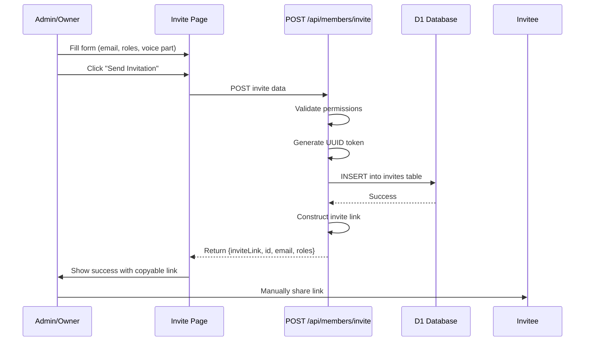
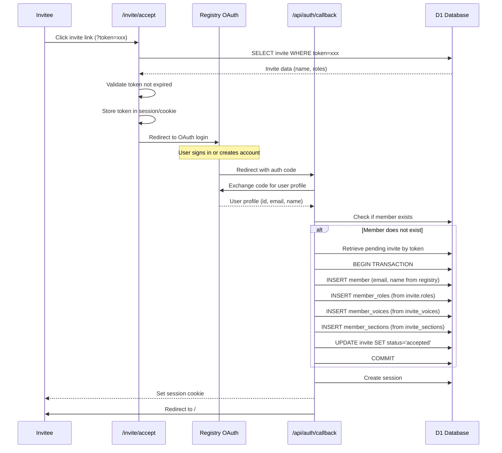

# Invitation Flow

## Overview

The invitation system allows existing members with admin or owner roles to invite new members to the vault. Invitations are token-based with a 48-hour expiration window.

## User Roles

### Who Can Invite

- **Admins**: Can invite librarians and admins
- **Owners**: Can invite librarians, admins, and owners

### Permission Rules

- Only owners can invite other owners
- Owner role checkbox is hidden from non-owners in the UI
- At least one role must be assigned to each invite

## Invitation Creation Flow



## Database Schema

### Invites Table (Migration 0009 - Proposed)

```sql
CREATE TABLE invites (
    id TEXT PRIMARY KEY,
    name TEXT NOT NULL,  -- Invitee name for tracking (not verified)
    token TEXT NOT NULL UNIQUE,
    invited_by TEXT NOT NULL REFERENCES members(id),
    expires_at TEXT NOT NULL,
    status TEXT NOT NULL DEFAULT 'pending'
        CHECK (status IN ('pending', 'accepted', 'expired')),
    roles TEXT NOT NULL DEFAULT '[]',  -- JSON array: ["admin", "librarian"]
    created_at TEXT NOT NULL DEFAULT (datetime('now')),
    accepted_at TEXT,
    accepted_by_email TEXT  -- Registry email (filled when accepted)
);
```

### Key Fields

- **name**: Display name for tracking invites (e.g., "John Doe"), not verified
- **token**: UUID v4, unique, used in invite link
- **expires_at**: Set to `datetime('now', '+48 hours')` on creation
- **roles**: JSON array of role strings (e.g., `["admin", "librarian"]`)
- **status**: `pending` | `accepted` | `expired`
- **accepted_by_email**: Registry-verified email, filled when invite is accepted

Voices and sections are assigned via separate `invite_voices` and `invite_sections` junction tables (migration 0003).

### Design Rationale

**Why no email field at creation?**

- Email comes from registry OAuth (source of truth)
- User might use different email than anticipated
- Email verification is registry's responsibility
- Name is sufficient for tracking pending invites ("Invitation for John Doe")

## Invite Link Structure

```
https://polyphony-vault.pages.dev/invite/accept?token={UUID}
```

Example:

```
https://polyphony-vault.pages.dev/invite/accept?token=a1b2c3d4-e5f6-7890-abcd-ef1234567890
```

## Current Implementation Status

### ✅ Implemented

- Invite creation with multi-role support
- Token generation (UUID v4)
- 48-hour expiration
- Permission validation (admin/owner checks)
- Database storage with roles and voice part
- Invite link generation
- Copy-to-clipboard UI

### 🚧 TODO

- **Email sending**: Currently manual link sharing only
- **Invite acceptance flow**:
  - `/invite/accept?token=xxx` route - validate and initiate OAuth
  - Modify `/api/auth/callback` to handle invite tokens
  - Store invite token across OAuth redirect (session storage)
  - Create member from invite + registry profile
- **Invite expiration cron job**: Auto-expire old invites
- **Invite list/management UI**: View pending/accepted invites
- **Resend invite**: Allow resending expired invites

## Acceptance Flow (Registry-Based Authentication)

The acceptance flow leverages the existing **registry OAuth** system. New users authenticate via the registry (creating an account there if needed), then vault membership is created automatically.



### Key Design Points

1. **Registry as Source of Truth**: User identity (name, email) comes from registry, not a separate signup form
2. **Token Validation First**: Before redirecting to OAuth, validate invite exists and hasn't expired
3. **Token Persistence**: Store invite token in session or secure cookie to retrieve after OAuth callback
4. **Atomic Member Creation**: Transaction ensures member + roles + invite status all update together
5. **Email Verification**: Registry handles email verification (not vault's responsibility)

### Implementation Steps

#### Step 1: `/invite/accept?token=xxx` (GET)

- Load invite from database
- Check expiration: `datetime(expires_at) > datetime('now')`
- If valid: store token in session, redirect to registry OAuth
- If expired: show "Invite expired" error page

#### Step 2: Registry OAuth Flow

- Standard OAuth 2.0 authorization code flow
- User may need to create registry account (if first time)
- Registry validates user identity

#### Step 3: `/api/auth/callback` (Modified)

- Retrieve stored invite token from session
- Exchange OAuth code for user profile
- Check if member already exists by email
- If new member:
  - Create member with registry profile data
  - Assign roles from invite
  - Set voice part from invite
  - Mark invite as accepted
- Create vault session
- Redirect to `/`

## Security Considerations

### Token Security

- **UUID v4**: Cryptographically random, 122 bits of entropy
- **Single-use**: Should be marked as accepted after first use
- **Expiration**: 48-hour window limits exposure
- **HTTPS only**: Tokens transmitted over encrypted connection

### Permission Validation

- Server-side role checks on every invite creation
- Owner-only validation for inviting owners
- Cannot bypass via client manipulation

### Database Constraints

- `UNIQUE` constraint on token (prevents duplicates)
- `REFERENCES` foreign key to members (ensures invited_by exists)
- `CHECK` constraint on status (enforces valid values)

## Example API Requests

### Create Invite

```http
POST /api/members/invite
Content-Type: application/json
Cookie: member_id=xxx

{
  "name": "Jane Singer",
  "roles": ["librarian"],
  "voiceIds": ["soprano-1"],
  "sectionIds": ["s1"]
}
```

**Response:**

```json
{
  "id": "inv-uuid",
  "name": "Jane Singer",
  "roles": ["librarian"],
  "voices": [{"id": "soprano-1", "name": "Soprano", "abbreviation": "S1"}],
  "sections": [{"id": "s1", "name": "Soprano 1", "abbreviation": "S1"}],
  "inviteLink": "https://polyphony-vault.pages.dev/invite/accept?token=xxx",
  "message": "Invitation created. Share the link with Jane Singer."
}
  "inviteLink": "https://polyphony-vault.pages.dev/invite/accept?token=xxx",
  "message": "Invitation created. Email will be sent to the recipient."
}
```

### Accept Invite (Not Yet Implemented)

```http
POST /api/auth/accept
Content-Type: application/json

{
  "token": "a1b2c3d4-e5f6-7890-abcd-ef1234567890",
  "name": "Jane Singer",
  "password": "secure-password"
}
```

## Migration History

- **0003**: Voices and sections system (replaced voice_part with junction tables)
- **0007**: Multi-role member system
- **0008**: Update invites for multi-role support (roles JSON array)
- **0009**: Replace email with name field, add accepted_by_email for OAuth flow

## Related Files

- `/routes/invite/+page.svelte` - Invite creation UI
- `/routes/invite/+page.server.ts` - Permission check for invite page
- `/routes/api/members/invite/+server.ts` - Invite creation API
- `/migrations/0008_update_invites_for_multirole.sql` - Latest schema
- `/lib/types.ts` - Shared Role and VoicePart types

## Future Enhancements

1. **Email Integration**
   - Resend API or SendGrid
   - HTML email templates
   - Automatic link sending

2. **Invite Management**
   - `/invites` page listing all pending/accepted invites
   - Ability to revoke pending invites
   - Resend/extend expiration

3. **Bulk Invites**
   - CSV upload
   - Multiple emails at once
   - Default role templates

4. **Audit Trail**
   - Track who invited whom
   - Record acceptance timestamps
   - Member join source tracking
