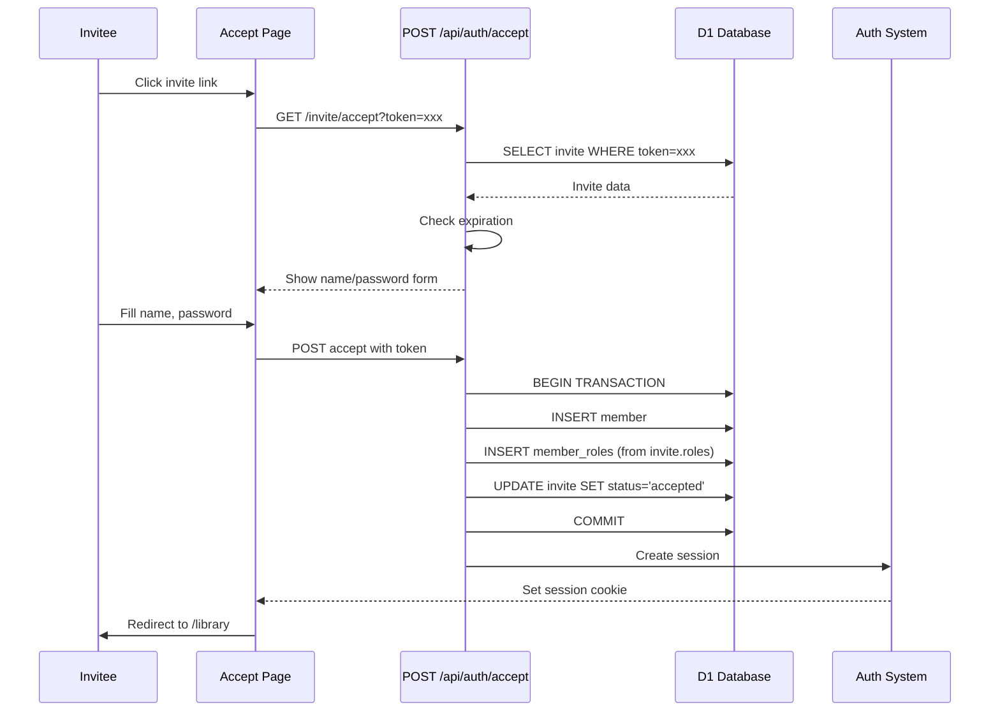

# Invitation Flow

## Overview

The invitation system allows existing members with admin or owner roles to invite new members to the vault. Invitations are token-based with a 48-hour expiration window.

## User Roles

### Who Can Invite
- **Admins**: Can invite librarians and admins
- **Owners**: Can invite librarians, admins, and owners

### Permission Rules
- Only owners can invite other owners
- Owner role checkbox is hidden from non-owners in the UI
- At least one role must be assigned to each invite

## Invitation Creation Flow


## Database Schema

### Invites Table (Migration 0008)

```sql
CREATE TABLE invites (
    id TEXT PRIMARY KEY,
    email TEXT NOT NULL,
    token TEXT NOT NULL UNIQUE,
    invited_by TEXT NOT NULL REFERENCES members(id),
    expires_at TEXT NOT NULL,
    status TEXT NOT NULL DEFAULT 'pending' 
        CHECK (status IN ('pending', 'accepted', 'expired')),
    roles TEXT NOT NULL DEFAULT '[]',  -- JSON array: ["admin", "librarian"]
    voice_part TEXT CHECK (voice_part IN ('S', 'A', 'T', 'B', 'SA', 'AT', 'TB', 'SAT', 'ATB', 'SATB')),
    created_at TEXT NOT NULL DEFAULT (datetime('now')),
    accepted_at TEXT
);
```

### Key Fields
- **token**: UUID v4, unique, used in invite link
- **expires_at**: Set to `datetime('now', '+48 hours')` on creation
- **roles**: JSON array of role strings (e.g., `["admin", "librarian"]`)
- **voice_part**: Optional, one of the valid SATB combinations
- **status**: `pending` | `accepted` | `expired`

## Invite Link Structure

```
https://polyphony-vault.pages.dev/invite/accept?token={UUID}
```

Example:
```
https://polyphony-vault.pages.dev/invite/accept?token=a1b2c3d4-e5f6-7890-abcd-ef1234567890
```

## Current Implementation Status

### ✅ Implemented
- Invite creation with multi-role support
- Token generation (UUID v4)
- 48-hour expiration
- Permission validation (admin/owner checks)
- Database storage with roles and voice part
- Invite link generation
- Copy-to-clipboard UI

### 🚧 TODO
- **Email sending**: Currently manual link sharing only
- **Invite acceptance flow**: `/invite/accept` route not implemented
- **Invite expiration cron job**: Auto-expire old invites
- **Invite list/management UI**: View pending/accepted invites
- **Resend invite**: Allow resending expired invites

## Acceptance Flow (Planned)



## Security Considerations

### Token Security
- **UUID v4**: Cryptographically random, 122 bits of entropy
- **Single-use**: Should be marked as accepted after first use
- **Expiration**: 48-hour window limits exposure
- **HTTPS only**: Tokens transmitted over encrypted connection

### Permission Validation
- Server-side role checks on every invite creation
- Owner-only validation for inviting owners
- Cannot bypass via client manipulation

### Database Constraints
- `UNIQUE` constraint on token (prevents duplicates)
- `REFERENCES` foreign key to members (ensures invited_by exists)
- `CHECK` constraints on status and voice_part (enforces valid values)

## Example API Requests

### Create Invite

```http
POST /api/members/invite
Content-Type: application/json
Cookie: member_id=xxx

{
  "email": "singer@example.com",
  "roles": ["librarian"],
  "voicePart": "S"
}
```

**Response:**
```json
{
  "id": "inv-uuid",
  "email": "singer@example.com",
  "roles": ["librarian"],
  "voicePart": "S",
  "inviteLink": "https://polyphony-vault.pages.dev/invite/accept?token=xxx",
  "message": "Invitation created. Email will be sent to the recipient."
}
```

### Accept Invite (Not Yet Implemented)

```http
POST /api/auth/accept
Content-Type: application/json

{
  "token": "a1b2c3d4-e5f6-7890-abcd-ef1234567890",
  "name": "Jane Singer",
  "password": "secure-password"
}
```

## Migration History

- **0003**: Initial invites table (single role)
- **0007**: Multi-role member system
- **0008**: Update invites for multi-role support (roles JSON array + voice_part)

## Related Files

- `/routes/invite/+page.svelte` - Invite creation UI
- `/routes/invite/+page.server.ts` - Permission check for invite page
- `/routes/api/members/invite/+server.ts` - Invite creation API
- `/migrations/0008_update_invites_for_multirole.sql` - Latest schema
- `/lib/types.ts` - Shared Role and VoicePart types

## Future Enhancements

1. **Email Integration**
   - Resend API or SendGrid
   - HTML email templates
   - Automatic link sending

2. **Invite Management**
   - `/invites` page listing all pending/accepted invites
   - Ability to revoke pending invites
   - Resend/extend expiration

3. **Bulk Invites**
   - CSV upload
   - Multiple emails at once
   - Default role templates

4. **Audit Trail**
   - Track who invited whom
   - Record acceptance timestamps
   - Member join source tracking
