# Database Schema

Vault D1 database schema (SQLite). Current state after migrations 0001-0004.

## Entity-Relationship Diagram

```mermaid
erDiagram
    members ||--o{ member_roles : "has"
    members ||--o{ member_voices : "can sing"
    members ||--o{ member_sections : "assigned to"
    members ||--o{ scores : "uploads"
    members ||--o{ invites : "invites"
    members ||--o{ takedowns : "processes"
    members ||--o{ access_log : "accesses"
    members ||--o{ sessions : "authenticates"
    members ||--o{ events : "creates"
    members ||--o{ vault_settings : "updates"

    voices ||--o{ member_voices : "assigned to"
    voices ||--o{ invite_voices : "pre-assigned"
    sections ||--o{ member_sections : "contains"
    sections ||--o{ invite_sections : "pre-assigned"
    sections ||--o{ sections : "parent of"

    invites ||--o{ invite_voices : "includes"
    invites ||--o{ invite_sections : "includes"

    scores ||--o{ score_files : "stored as"
    scores ||--o{ score_chunks : "chunked as"
    scores ||--o{ event_programs : "appears in"

    events ||--o{ event_programs : "contains"

    members {
        TEXT id PK
        TEXT email UK "NOT NULL"
        TEXT name
        TEXT invited_by FK
        TEXT joined_at
    }

    member_roles {
        TEXT member_id PK,FK
        TEXT role PK "owner|admin|librarian|conductor|section_leader"
        TEXT granted_at
        TEXT granted_by FK
    }

    voices {
        TEXT id PK
        TEXT name UK "NOT NULL"
        TEXT abbreviation "NOT NULL"
        TEXT category "vocal|instrumental"
        TEXT range_group "soprano|alto|tenor|bass|etc"
        INTEGER display_order "NOT NULL"
        INTEGER is_active "0|1"
    }

    sections {
        TEXT id PK
        TEXT name "NOT NULL"
        TEXT abbreviation "NOT NULL"
        TEXT parent_section_id FK
        INTEGER display_order "NOT NULL"
        INTEGER is_active "0|1"
    }

    member_voices {
        TEXT member_id PK,FK
        TEXT voice_id PK,FK
        INTEGER is_primary "0|1"
        TEXT assigned_at
        TEXT assigned_by FK
        TEXT notes
    }

    member_sections {
        TEXT member_id PK,FK
        TEXT section_id PK,FK
        INTEGER is_primary "0|1"
        TEXT joined_at
        TEXT assigned_by FK
        TEXT notes
    }

    scores {
        TEXT id PK
        TEXT title "NOT NULL"
        TEXT composer
        TEXT arranger
        TEXT license_type "public_domain|licensed|owned|pending"
        TEXT file_key "NOT NULL"
        TEXT uploaded_by FK
        TEXT uploaded_at
        TEXT deleted_at "soft delete"
    }

    score_files {
        TEXT score_id PK,FK
        BLOB data "nullable if chunked"
        INTEGER size "NOT NULL"
        TEXT original_name
        TEXT uploaded_at
        INTEGER is_chunked "0|1"
        INTEGER chunk_count "nullable"
    }

    score_chunks {
        TEXT score_id PK,FK
        INTEGER chunk_index PK
        BLOB data "NOT NULL"
        INTEGER size "NOT NULL"
    }

    invites {
        TEXT id PK
        TEXT name "NOT NULL"
        TEXT token UK "NOT NULL"
        TEXT invited_by FK
        TEXT expires_at "NOT NULL"
        TEXT status "pending|accepted"
        TEXT roles "JSON array"
        TEXT created_at
        TEXT accepted_at
        TEXT accepted_by_email "Registry-verified"
    }

    invite_voices {
        TEXT invite_id PK,FK
        TEXT voice_id PK,FK
        INTEGER is_primary "0|1"
    }

    invite_sections {
        TEXT invite_id PK,FK
        TEXT section_id PK,FK
        INTEGER is_primary "0|1"
    }

    vault_settings {
        TEXT key PK
        TEXT value "NOT NULL"
        TEXT updated_by FK
        TEXT updated_at
    }

    events {
        TEXT id PK
        TEXT title "NOT NULL"
        TEXT description
        TEXT location
        TEXT starts_at "NOT NULL"
        TEXT ends_at
        TEXT event_type "rehearsal|concert|retreat"
        TEXT created_by FK
        TEXT created_at
    }

    event_programs {
        TEXT event_id PK,FK
        TEXT score_id PK,FK
        INTEGER position
        TEXT notes
        TEXT added_at
    }

    sessions {
        TEXT id PK
        TEXT member_id FK
        TEXT created_at
        TEXT expires_at
    }

    takedowns {
        INTEGER id PK
        TEXT score_id FK
        TEXT requester_email
        TEXT reason
        TEXT status "pending|approved|rejected"
        TEXT submitted_at
        TEXT processed_at
        TEXT processed_by FK
    }

    access_log {
        INTEGER id PK
        TEXT member_id FK
        TEXT score_id FK
        TEXT action "download|view"
        TEXT accessed_at
    }
```

## Tables

### Core Entities

#### members

Vault members (authenticated users).

| Column     | Type | Constraints      | Description             |
| ---------- | ---- | ---------------- | ----------------------- |
| id         | TEXT | PK               | Unique member ID        |
| email      | TEXT | NOT NULL, UNIQUE | Email from Registry     |
| name       | TEXT |                  | Display name            |
| invited_by | TEXT | FK → members(id) | Who invited this member |
| joined_at  | TEXT | DEFAULT now()    | Timestamp               |

**Indexes:** None additional (PK on id, UNIQUE on email)

**Note:** Voice capabilities and section assignments are stored in junction tables `member_voices` and `member_sections`.

---

#### member_roles

Multi-role support via junction table.

| Column     | Type | Constraints          | Description                                                  |
| ---------- | ---- | -------------------- | ------------------------------------------------------------ |
| member_id  | TEXT | PK, FK → members(id) | Member reference                                             |
| role       | TEXT | PK, CHECK            | `owner`, `admin`, `librarian`, `conductor`, `section_leader` |
| granted_at | TEXT | DEFAULT now()        | When role assigned                                           |
| granted_by | TEXT | FK → members(id)     | Who granted role                                             |

**Indexes:**

- `idx_member_roles_member` on member_id
- `idx_member_roles_role` on role

**Constraints:**

- At least one owner must exist (application logic)
- Owner role is protected (cannot remove last owner)

---

### Voices and Sections

#### voices

Vocal capabilities that members can have (what they CAN sing).

| Column        | Type    | Constraints         | Description                           |
| ------------- | ------- | ------------------- | ------------------------------------- |
| id            | TEXT    | PK                  | Voice ID (e.g., 'soprano', 'tenor')   |
| name          | TEXT    | NOT NULL, UNIQUE    | Display name                          |
| abbreviation  | TEXT    | NOT NULL            | Short code (e.g., 'S', 'T')           |
| category      | TEXT    | CHECK               | `vocal` or `instrumental`             |
| range_group   | TEXT    |                     | Grouping (soprano, alto, tenor, bass) |
| display_order | INTEGER | NOT NULL            | Sort order for UI                     |
| is_active     | INTEGER | NOT NULL, DEFAULT 1 | 0=hidden, 1=available                 |

**Indexes:**

- `idx_voices_category` on category
- `idx_voices_display_order` on display_order

**Seeded Data:** Soprano, Alto, Tenor, Baritone, Bass (active); subdivisions like Soprano I, Soprano II (inactive by default)

---

#### sections

Performance assignments (where members DO sing in a particular piece/season).

| Column            | Type    | Constraints         | Description                             |
| ----------------- | ------- | ------------------- | --------------------------------------- |
| id                | TEXT    | PK                  | Section ID (e.g., 'soprano', 'tenor-1') |
| name              | TEXT    | NOT NULL            | Display name                            |
| abbreviation      | TEXT    | NOT NULL            | Short code (e.g., 'S', 'T1')            |
| parent_section_id | TEXT    | FK → sections(id)   | Parent section for subdivisions         |
| display_order     | INTEGER | NOT NULL            | Sort order for UI                       |
| is_active         | INTEGER | NOT NULL, DEFAULT 1 | 0=hidden, 1=available                   |

**Indexes:**

- `idx_sections_display_order` on display_order
- `idx_sections_parent` on parent_section_id

**Seeded Data:** Mirrors voices structure with parent relationships for subdivisions

---

#### member_voices

Junction table: which voices each member can sing.

| Column      | Type    | Constraints                            | Description                   |
| ----------- | ------- | -------------------------------------- | ----------------------------- |
| member_id   | TEXT    | PK, FK → members(id) ON DELETE CASCADE | Member reference              |
| voice_id    | TEXT    | PK, FK → voices(id) ON DELETE CASCADE  | Voice reference               |
| is_primary  | INTEGER | NOT NULL, DEFAULT 0, CHECK 0\|1        | Primary voice for this member |
| assigned_at | TEXT    | DEFAULT now()                          | When assigned                 |
| assigned_by | TEXT    | FK → members(id)                       | Who assigned                  |
| notes       | TEXT    |                                        | Optional notes                |

**Indexes:**

- `idx_member_voices_member` on member_id
- `idx_member_voices_voice` on voice_id
- `idx_member_voices_primary` on is_primary WHERE is_primary = 1

**Triggers:**

- `enforce_single_primary_voice` - Ensures only one primary voice per member

---

#### member_sections

Junction table: which sections each member is assigned to.

| Column      | Type    | Constraints                             | Description                     |
| ----------- | ------- | --------------------------------------- | ------------------------------- |
| member_id   | TEXT    | PK, FK → members(id) ON DELETE CASCADE  | Member reference                |
| section_id  | TEXT    | PK, FK → sections(id) ON DELETE CASCADE | Section reference               |
| is_primary  | INTEGER | NOT NULL, DEFAULT 0, CHECK 0\|1         | Primary section for this member |
| joined_at   | TEXT    | DEFAULT now()                           | When assigned                   |
| assigned_by | TEXT    | FK → members(id)                        | Who assigned                    |
| notes       | TEXT    |                                         | Optional notes                  |

**Indexes:**

- `idx_member_sections_member` on member_id
- `idx_member_sections_section` on section_id
- `idx_member_sections_primary` on is_primary WHERE is_primary = 1

**Triggers:**

- `enforce_single_primary_section` - Ensures only one primary section per member

---

### Scores

#### scores

Sheet music metadata.

| Column       | Type | Constraints      | Description                                     |
| ------------ | ---- | ---------------- | ----------------------------------------------- |
| id           | TEXT | PK               | Unique score ID                                 |
| title        | TEXT | NOT NULL         | Score title                                     |
| composer     | TEXT |                  | Composer name                                   |
| arranger     | TEXT |                  | Arranger name                                   |
| license_type | TEXT | CHECK            | `public_domain`, `licensed`, `owned`, `pending` |
| file_key     | TEXT | NOT NULL         | Storage key (legacy, unused with D1)            |
| uploaded_by  | TEXT | FK → members(id) | Uploader                                        |
| uploaded_at  | TEXT | DEFAULT now()    | Upload timestamp                                |
| deleted_at   | TEXT |                  | Soft delete timestamp                           |

**Indexes:** None additional

---

#### score_files

PDF metadata and single-row storage (≤2MB files).

| Column        | Type    | Constraints         | Description                           |
| ------------- | ------- | ------------------- | ------------------------------------- |
| score_id      | TEXT    | PK, FK → scores(id) | Score reference                       |
| data          | BLOB    |                     | PDF binary (NULL if `is_chunked=1`)   |
| size          | INTEGER | NOT NULL            | Total file size in bytes              |
| original_name | TEXT    |                     | Original filename                     |
| uploaded_at   | TEXT    | DEFAULT now()       | Upload timestamp                      |
| is_chunked    | INTEGER | NOT NULL, DEFAULT 0 | 0=single row, 1=chunked               |
| chunk_count   | INTEGER |                     | Number of chunks (NULL if single row) |

**Indexes:** None additional (PK on score_id)

---

#### score_chunks

Large file storage (>2MB files split into chunks).

| Column      | Type    | Constraints         | Description                |
| ----------- | ------- | ------------------- | -------------------------- |
| score_id    | TEXT    | PK, FK → scores(id) | Score reference            |
| chunk_index | INTEGER | PK                  | Chunk number (0-based)     |
| data        | BLOB    | NOT NULL            | Chunk binary data (~1.9MB) |
| size        | INTEGER | NOT NULL            | Chunk size in bytes        |

**Indexes:**

- `idx_score_chunks_score_id` on score_id

**Chunking Strategy:**

- Files ≤2MB: Single row in `score_files` (`data` filled, `is_chunked=0`)
- Files >2MB: Metadata row in `score_files` (`data=NULL`, `is_chunked=1`) + N rows in `score_chunks`
- Chunk size: ~1.9MB (safely under D1's 2MB row limit)
- Max file size: ~9.5MB (5 chunks × 1.9MB)

---

### Invitations

#### invites

Pending member invitations (name-based, multi-role support, with pre-assigned voices/sections).

| Column            | Type | Constraints      | Description                                    |
| ----------------- | ---- | ---------------- | ---------------------------------------------- |
| id                | TEXT | PK               | Invite ID                                      |
| name              | TEXT | NOT NULL         | Invitee name (tracking only, not verified)     |
| token             | TEXT | NOT NULL, UNIQUE | Secret invite token                            |
| invited_by        | TEXT | FK → members(id) | Inviter                                        |
| expires_at        | TEXT | NOT NULL         | Expiration timestamp (48h default)             |
| status            | TEXT | CHECK            | `pending`, `accepted`                          |
| roles             | TEXT | NOT NULL         | JSON array of roles to grant                   |
| created_at        | TEXT | DEFAULT now()    | Created timestamp                              |
| accepted_at       | TEXT |                  | Acceptance timestamp                           |
| accepted_by_email | TEXT |                  | Registry-verified email (filled on acceptance) |

**Indexes:**

- `idx_invites_token` on token
- `idx_invites_status` on status

**Notes:**

- Email comes from Registry OAuth on acceptance (not stored in invite)
- Voices and sections are stored in `invite_voices` and `invite_sections` junction tables
- On acceptance, voices/sections are transferred to `member_voices` and `member_sections`

---

#### invite_voices

Junction table: voices to assign when invite is accepted.

| Column     | Type    | Constraints                            | Description                    |
| ---------- | ------- | -------------------------------------- | ------------------------------ |
| invite_id  | TEXT    | PK, FK → invites(id) ON DELETE CASCADE | Invite reference               |
| voice_id   | TEXT    | PK, FK → voices(id) ON DELETE CASCADE  | Voice reference                |
| is_primary | INTEGER | NOT NULL, DEFAULT 0                    | Will be primary for new member |

**Indexes:**

- `idx_invite_voices_invite` on invite_id

---

#### invite_sections

Junction table: sections to assign when invite is accepted.

| Column     | Type    | Constraints                             | Description                    |
| ---------- | ------- | --------------------------------------- | ------------------------------ |
| invite_id  | TEXT    | PK, FK → invites(id) ON DELETE CASCADE  | Invite reference               |
| section_id | TEXT    | PK, FK → sections(id) ON DELETE CASCADE | Section reference              |
| is_primary | INTEGER | NOT NULL, DEFAULT 0                     | Will be primary for new member |

**Indexes:**

- `idx_invite_sections_invite` on invite_id

---

### Supporting Tables

#### sessions

Authentication sessions.

| Column     | Type | Constraints      | Description      |
| ---------- | ---- | ---------------- | ---------------- |
| id         | TEXT | PK               | Session ID       |
| member_id  | TEXT | FK → members(id) | Member reference |
| created_at | TEXT | DEFAULT now()    | Session start    |
| expires_at | TEXT |                  | Session expiry   |

**Indexes:**

- `idx_sessions_member` on member_id

---

#### takedowns

Copyright takedown requests.

| Column          | Type    | Constraints      | Description                       |
| --------------- | ------- | ---------------- | --------------------------------- |
| id              | INTEGER | PK AUTOINCREMENT | Takedown ID                       |
| score_id        | TEXT    | FK → scores(id)  | Target score                      |
| requester_email | TEXT    |                  | Requester contact                 |
| reason          | TEXT    |                  | Takedown reason                   |
| status          | TEXT    | CHECK            | `pending`, `approved`, `rejected` |
| submitted_at    | TEXT    | DEFAULT now()    | Submission timestamp              |
| processed_at    | TEXT    |                  | Processing timestamp              |
| processed_by    | TEXT    | FK → members(id) | Admin who processed               |

**Indexes:**

- `idx_takedowns_score` on score_id
- `idx_takedowns_status` on status

---

#### access_log

Audit trail for score access.

| Column      | Type    | Constraints      | Description        |
| ----------- | ------- | ---------------- | ------------------ |
| id          | INTEGER | PK AUTOINCREMENT | Log entry ID       |
| member_id   | TEXT    | FK → members(id) | Accessor           |
| score_id    | TEXT    | FK → scores(id)  | Accessed score     |
| action      | TEXT    |                  | `download`, `view` |
| accessed_at | TEXT    | DEFAULT now()    | Access timestamp   |

**Indexes:**

- `idx_access_log_member` on member_id
- `idx_access_log_score` on score_id

---

#### vault_settings

Configuration settings for the vault (key-value store with audit trail).

| Column     | Type | Constraints      | Description             |
| ---------- | ---- | ---------------- | ----------------------- |
| key        | TEXT | PK               | Setting key             |
| value      | TEXT | NOT NULL         | Setting value           |
| updated_by | TEXT | FK → members(id) | Member who last updated |
| updated_at | TEXT | DEFAULT now()    | Last update timestamp   |

**Indexes:** None additional

**Default settings:**

- `default_event_duration`: '120' (minutes)

---

### Event Management

#### events

Rehearsals, concerts, and other choir events.

| Column      | Type | Constraints      | Description                       |
| ----------- | ---- | ---------------- | --------------------------------- |
| id          | TEXT | PK               | Event ID                          |
| title       | TEXT | NOT NULL         | Event title                       |
| description | TEXT |                  | Event description                 |
| location    | TEXT |                  | Event location                    |
| starts_at   | TEXT | NOT NULL         | Start datetime (ISO 8601)         |
| ends_at     | TEXT |                  | End datetime (ISO 8601)           |
| event_type  | TEXT | CHECK            | `rehearsal`, `concert`, `retreat` |
| created_by  | TEXT | FK → members(id) | Creator                           |
| created_at  | TEXT | DEFAULT now()    | Creation timestamp                |

**Indexes:**

- `idx_events_starts_at` on starts_at
- `idx_events_type` on event_type

---

#### event_programs

Setlists linking scores to events in order.

| Column   | Type    | Constraints                           | Description                |
| -------- | ------- | ------------------------------------- | -------------------------- |
| event_id | TEXT    | PK, FK → events(id) ON DELETE CASCADE | Event reference            |
| score_id | TEXT    | PK, FK → scores(id) ON DELETE CASCADE | Score reference            |
| position | INTEGER | NOT NULL, DEFAULT 0                   | Order in program (0-based) |
| notes    | TEXT    |                                       | Notes about this piece     |
| added_at | TEXT    | DEFAULT now()                         | When added to program      |

**Indexes:**

- `idx_event_programs_event` on event_id
- `idx_event_programs_score` on score_id

**Constraints:**

- Composite primary key (event_id, score_id) prevents duplicate scores in same event

---

## Key Relationships

### Member → Roles (Many-to-Many)

A member can have multiple roles (owner, admin, librarian, conductor, section_leader). Authenticated membership implies basic "singer" permissions (view/download).

### Member → Voices (Many-to-Many)

A member can have multiple voice capabilities (e.g., can sing both Tenor and Baritone). One voice is marked as primary. Managed via `member_voices` junction table.

### Member → Sections (Many-to-Many)

A member can be assigned to multiple sections (e.g., Tenor I for most pieces, but Full Choir for others). One section is marked as primary. Managed via `member_sections` junction table.

### Member → Scores (One-to-Many)

Each score is uploaded by one member. Members can upload multiple scores (if they have librarian role).

### Score → Files (One-to-One with Optional Chunks)

Each score has 1 metadata row in `score_files`. Large files (>2MB) also have N rows in `score_chunks`.

### Member → Invites (One-to-Many)

A member (admin/owner) can send multiple invitations. Invites can pre-assign voices and sections that transfer to the new member on acceptance.

### Section → Section (Self-referential)

Sections can have parent sections (e.g., "Soprano I" is a child of "Soprano"). This allows hierarchical organization.

### Member → Events (One-to-Many)

Each event is created by one member (with conductor/owner role). Members can create multiple events.

### Event → Programs (One-to-Many)

Each event has one program (setlist) with multiple scores. Scores are ordered by position.

## Data Constraints

### License Types

- `public_domain` - No restrictions
- `licensed` - Licensed for use
- `owned` - Owned by choir
- `pending` - Rights verification pending

### Role Types

- `owner` - Vault superuser (protected, at least 1 required)
- `admin` - Member management
- `librarian` - Score management
- `conductor` - Event and attendance management
- `section_leader` - Section-specific management

### Event Types

- `rehearsal` - Regular practice session
- `concert` - Performance event
- `retreat` - Multi-day gathering

### Invite Status

- `pending` - Invite created, not yet accepted
- `accepted` - Invite used to create member

## Migration History

| Migration | Description                                                                                                                                                                                                                  |
| --------- | ---------------------------------------------------------------------------------------------------------------------------------------------------------------------------------------------------------------------------- |
| **0001**  | **Complete schema** - Consolidated base schema with members, member_roles, scores, score_files, score_chunks, invites, sessions, takedowns, access_log, vault_settings, events, event_programs.                              |
| **0002**  | **Section leader role** - Added `section_leader` to member_roles CHECK constraint.                                                                                                                                           |
| **0003**  | **Voices and sections** - Added voices, sections, member_voices, member_sections, invite_voices, invite_sections tables. Removed voice_part columns from members and invites. Added triggers for single-primary enforcement. |
| **0004**  | **Remove default_voice_part** - Removed deprecated setting from vault_settings.                                                                                                                                              |

## See Also

- [roles.md](../apps/vault/docs/roles.md) - Role definitions and permissions
- [migrations/](../apps/vault/migrations/) - SQL migration files
- TypeScript interfaces: `../apps/vault/src/lib/types.ts`
