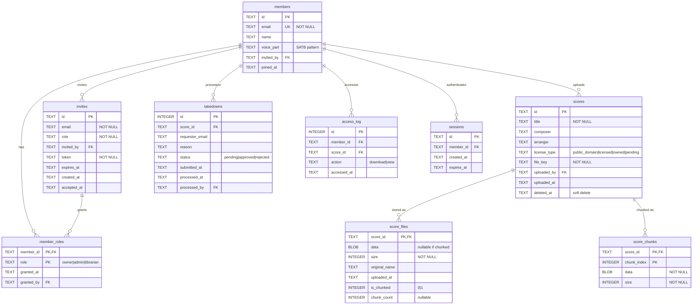

# Database Schema

Vault D1 database schema (SQLite). Current state after migration 0007.

## Entity-Relationship Diagram

## Tables

### Core Entities

#### members

Vault members (authenticated users).

| Column     | Type | Constraints      | Description                                            |
| ---------- | ---- | ---------------- | ------------------------------------------------------ |
| id         | TEXT | PK               | Unique member ID                                       |
| email      | TEXT | NOT NULL, UNIQUE | Email from Registry                                    |
| name       | TEXT |                  | Display name                                           |
| voice_part | TEXT | CHECK            | Voice section: `[SATB]{1,4}` (e.g., `S`, `AT`, `SATB`) |
| invited_by | TEXT | FK → members(id) | Who invited this member                                |
| joined_at  | TEXT | DEFAULT now()    | Timestamp                                              |

**Indexes:** None additional (PK on id, UNIQUE on email)

---

#### member_roles

Multi-role support via junction table.

| Column     | Type | Constraints          | Description                   |
| ---------- | ---- | -------------------- | ----------------------------- |
| member_id  | TEXT | PK, FK → members(id) | Member reference              |
| role       | TEXT | PK, CHECK            | `owner`, `admin`, `librarian` |
| granted_at | TEXT | DEFAULT now()        | When role assigned            |
| granted_by | TEXT | FK → members(id)     | Who granted role              |

**Indexes:**

- `idx_member_roles_member` on member_id
- `idx_member_roles_role` on role

**Constraints:**

- At least one owner must exist (application logic)
- Owner role is protected (cannot remove last owner)

---

#### scores

Sheet music metadata.

| Column       | Type | Constraints      | Description                                     |
| ------------ | ---- | ---------------- | ----------------------------------------------- |
| id           | TEXT | PK               | Unique score ID                                 |
| title        | TEXT | NOT NULL         | Score title                                     |
| composer     | TEXT |                  | Composer name                                   |
| arranger     | TEXT |                  | Arranger name                                   |
| license_type | TEXT | CHECK            | `public_domain`, `licensed`, `owned`, `pending` |
| file_key     | TEXT | NOT NULL         | Storage key (legacy, unused with D1)            |
| uploaded_by  | TEXT | FK → members(id) | Uploader                                        |
| uploaded_at  | TEXT | DEFAULT now()    | Upload timestamp                                |
| deleted_at   | TEXT |                  | Soft delete timestamp                           |

**Indexes:** None additional

---

#### score_files

PDF metadata and single-row storage (≤2MB files).

| Column        | Type    | Constraints         | Description                           |
| ------------- | ------- | ------------------- | ------------------------------------- |
| score_id      | TEXT    | PK, FK → scores(id) | Score reference                       |
| data          | BLOB    |                     | PDF binary (NULL if `is_chunked=1`)   |
| size          | INTEGER | NOT NULL            | Total file size in bytes              |
| original_name | TEXT    |                     | Original filename                     |
| uploaded_at   | TEXT    | DEFAULT now()       | Upload timestamp                      |
| is_chunked    | INTEGER | NOT NULL, DEFAULT 0 | 0=single row, 1=chunked               |
| chunk_count   | INTEGER |                     | Number of chunks (NULL if single row) |

**Indexes:** None additional (PK on score_id)

---

#### score_chunks

Large file storage (>2MB files split into chunks).

| Column      | Type    | Constraints         | Description                |
| ----------- | ------- | ------------------- | -------------------------- |
| score_id    | TEXT    | PK, FK → scores(id) | Score reference            |
| chunk_index | INTEGER | PK                  | Chunk number (0-based)     |
| data        | BLOB    | NOT NULL            | Chunk binary data (~1.9MB) |
| size        | INTEGER | NOT NULL            | Chunk size in bytes        |

**Indexes:**

- `idx_score_chunks_score_id` on score_id

**Chunking Strategy:**

- Files ≤2MB: Single row in `score_files` (`data` filled, `is_chunked=0`)
- Files >2MB: Metadata row in `score_files` (`data=NULL`, `is_chunked=1`) + N rows in `score_chunks`
- Chunk size: ~1.9MB (safely under D1's 2MB row limit)
- Max file size: ~9.5MB (5 chunks × 1.9MB)

---

### Supporting Tables

#### invites

Pending member invitations.

| Column      | Type | Constraints      | Description           |
| ----------- | ---- | ---------------- | --------------------- |
| id          | TEXT | PK               | Invite ID             |
| email       | TEXT | NOT NULL         | Invitee email         |
| role        | TEXT | NOT NULL, CHECK  | Initial role to grant |
| invited_by  | TEXT | FK → members(id) | Inviter               |
| token       | TEXT | NOT NULL         | Secret invite token   |
| expires_at  | TEXT |                  | Expiration timestamp  |
| created_at  | TEXT | DEFAULT now()    | Created timestamp     |
| accepted_at | TEXT |                  | Acceptance timestamp  |

**Indexes:**

- `idx_invites_token` on token
- `idx_invites_email` on email

---

#### sessions

Authentication sessions.

| Column     | Type | Constraints      | Description      |
| ---------- | ---- | ---------------- | ---------------- |
| id         | TEXT | PK               | Session ID       |
| member_id  | TEXT | FK → members(id) | Member reference |
| created_at | TEXT | DEFAULT now()    | Session start    |
| expires_at | TEXT |                  | Session expiry   |

**Indexes:**

- `idx_sessions_member` on member_id

---

#### takedowns

Copyright takedown requests.

| Column          | Type    | Constraints      | Description                       |
| --------------- | ------- | ---------------- | --------------------------------- |
| id              | INTEGER | PK AUTOINCREMENT | Takedown ID                       |
| score_id        | TEXT    | FK → scores(id)  | Target score                      |
| requester_email | TEXT    |                  | Requester contact                 |
| reason          | TEXT    |                  | Takedown reason                   |
| status          | TEXT    | CHECK            | `pending`, `approved`, `rejected` |
| submitted_at    | TEXT    | DEFAULT now()    | Submission timestamp              |
| processed_at    | TEXT    |                  | Processing timestamp              |
| processed_by    | TEXT    | FK → members(id) | Admin who processed               |

**Indexes:**

- `idx_takedowns_score` on score_id
- `idx_takedowns_status` on status

---

#### access_log

Audit trail for score access.

| Column      | Type    | Constraints      | Description        |
| ----------- | ------- | ---------------- | ------------------ |
| id          | INTEGER | PK AUTOINCREMENT | Log entry ID       |
| member_id   | TEXT    | FK → members(id) | Accessor           |
| score_id    | TEXT    | FK → scores(id)  | Accessed score     |
| action      | TEXT    |                  | `download`, `view` |
| accessed_at | TEXT    | DEFAULT now()    | Access timestamp   |

**Indexes:**

- `idx_access_log_member` on member_id
- `idx_access_log_score` on score_id

---

## Key Relationships

### Member → Roles (Many-to-Many)

A member can have multiple roles (owner, admin, librarian). Authenticated membership implies basic "singer" permissions (view/download).

### Member → Scores (One-to-Many)

Each score is uploaded by one member. Members can upload multiple scores (if they have librarian role).

### Score → Files (One-to-One with Optional Chunks)

Each score has 1 metadata row in `score_files`. Large files (>2MB) also have N rows in `score_chunks`.

### Member → Invites (One-to-Many)

A member (admin/owner) can send multiple invitations. Invites create new members when accepted.

## Data Constraints

### Voice Part Pattern

`voice_part` must match: `[SATB]{1,4}` (1-4 characters, only S/A/T/B)

- Valid: `S`, `AT`, `SATB`, `TB`
- Invalid: `SS`, `X`, `SATBR`

### License Types

- `public_domain` - No restrictions
- `licensed` - Licensed for use
- `owned` - Owned by choir
- `pending` - Rights verification pending

### Role Types

- `owner` - Vault superuser (protected, at least 1 required)
- `admin` - Member management
- `librarian` - Score management

## Migration History

| Migration | Description                                                |
| --------- | ---------------------------------------------------------- |
| 0001      | Initial schema: members, scores, access_log                |
| 0002      | Add score_files table for binary storage                   |
| 0003      | Add invites table                                          |
| 0004      | Add takedowns table                                        |
| 0005      | Add score_chunks table for large file support              |
| 0006      | Fix score_files.data nullable + add is_chunked/chunk_count |
| **0007**  | **Multi-role support: member_roles junction, voice_part**  |

## See Also

- [roles.md](../apps/vault/docs/roles.md) - Role definitions and permissions
- [migrations/](../apps/vault/migrations/) - SQL migration files
- TypeScript interfaces: `apps/vault/src/lib/server/db/members.ts`
