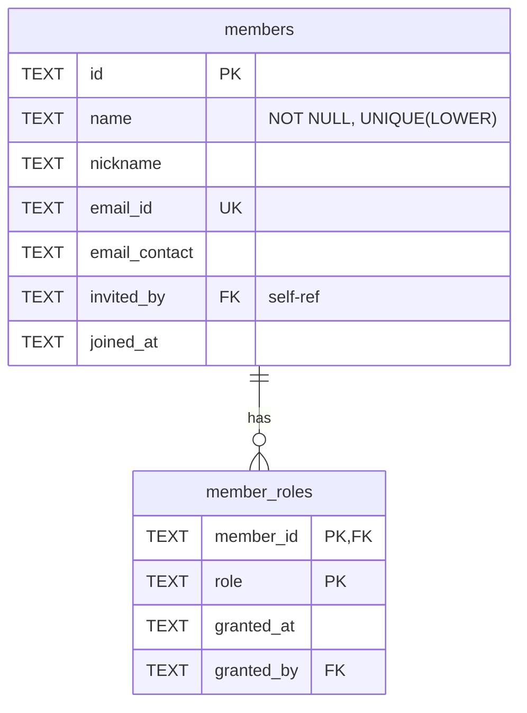
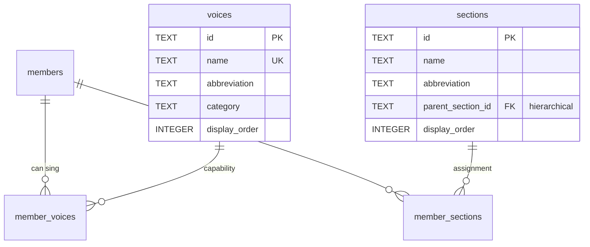
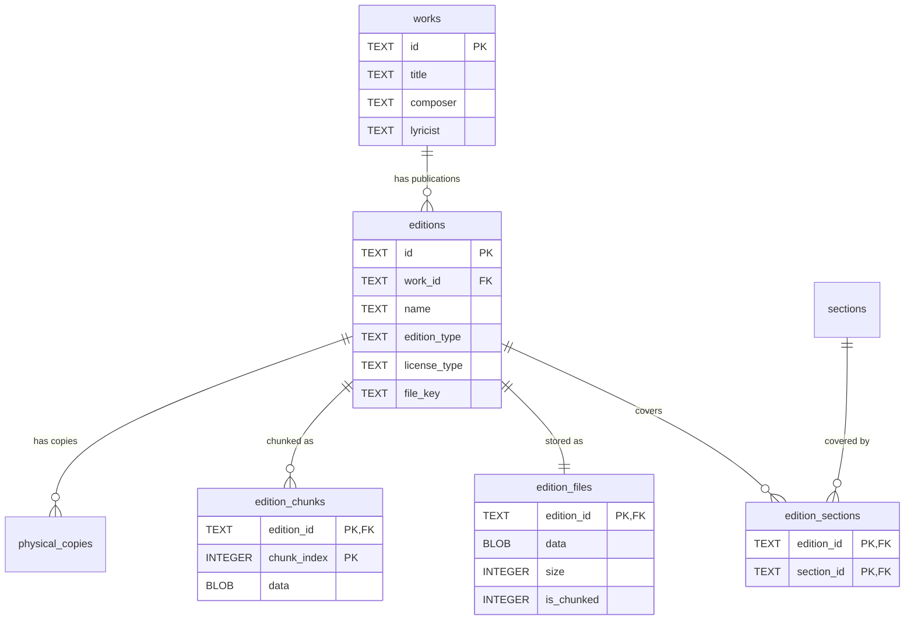
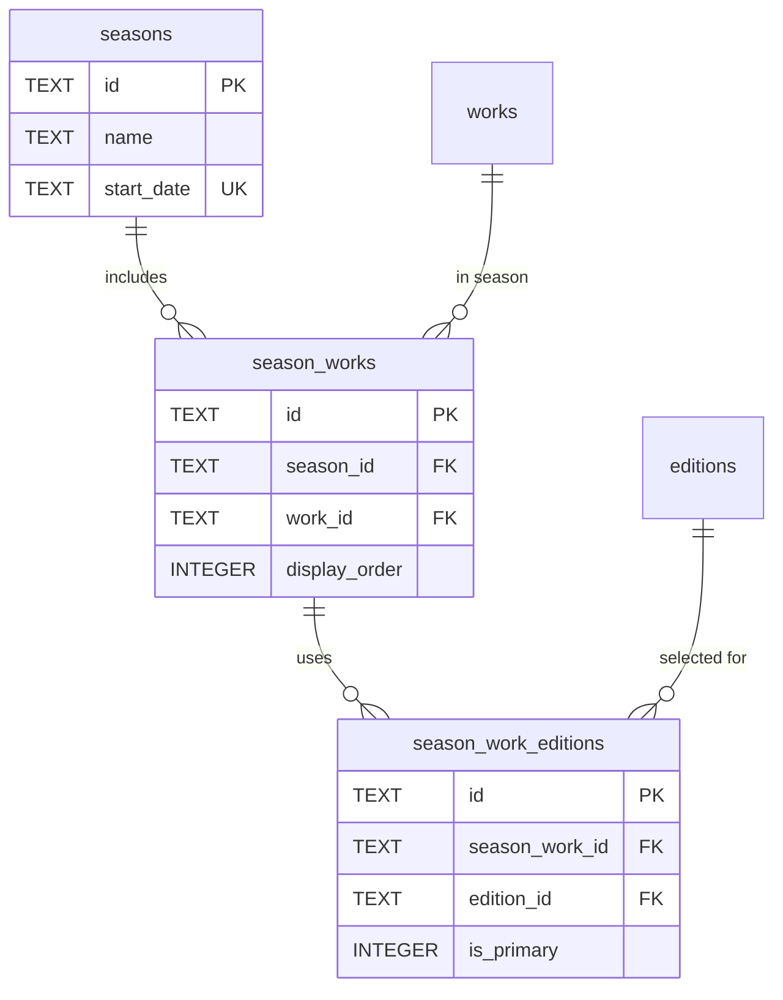
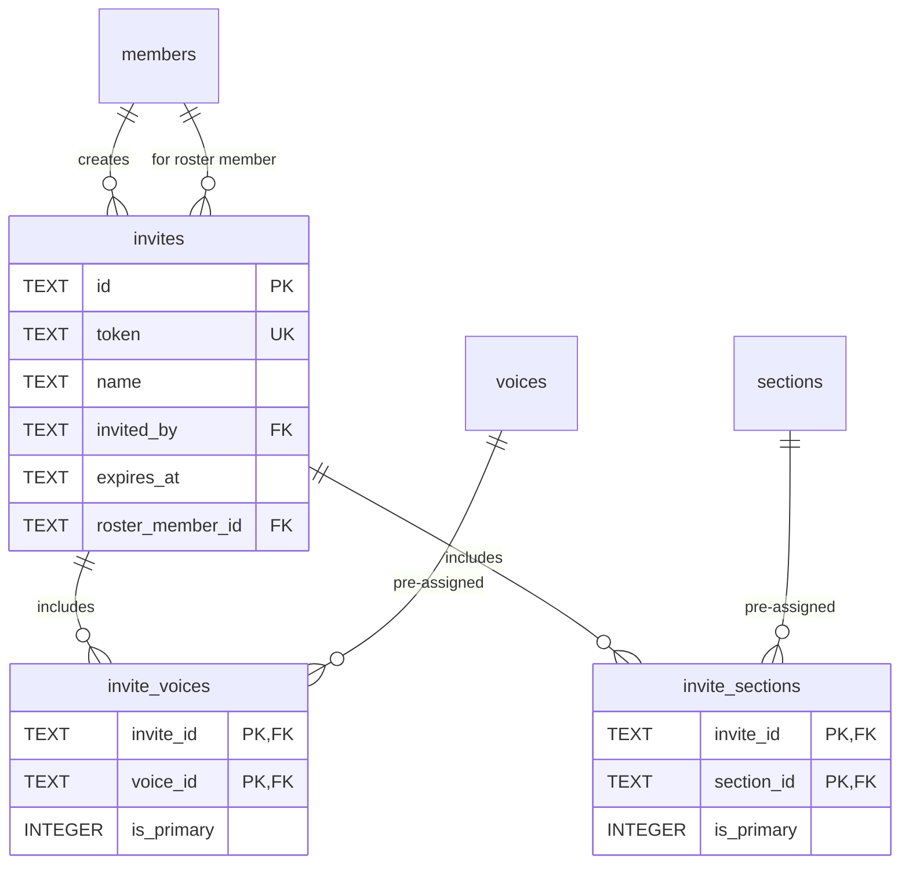
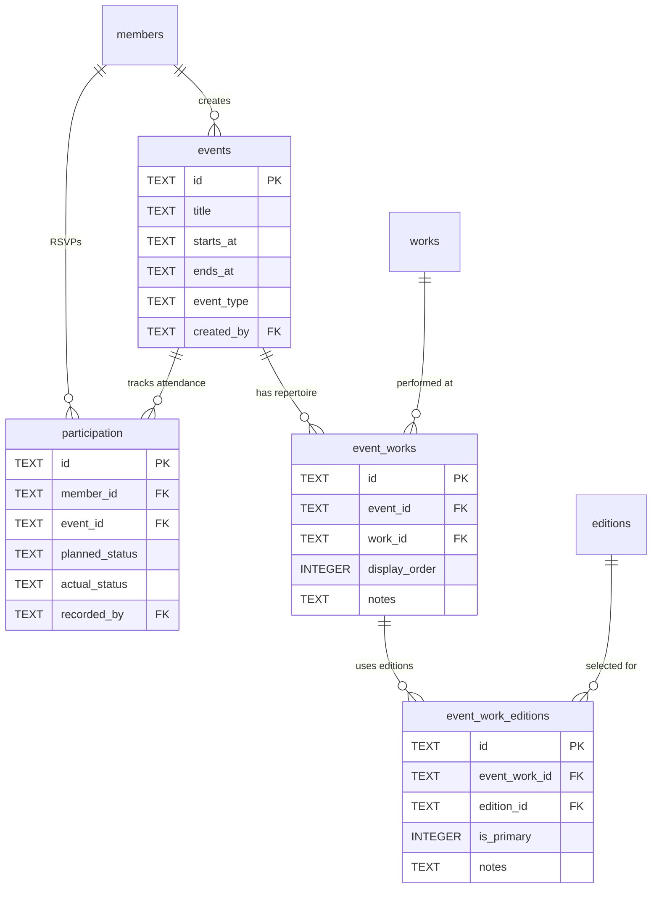

# Database Schema

Vault D1 database schema (SQLite). Current state after migrations 0001-0025.

## Tables

### Core Entities

#### members

Vault members. Can be roster-only (no email_id) or registered via OAuth (has email_id).

| Column        | Type | Constraints              | Description                                 |
| ------------- | ---- | ------------------------ | ------------------------------------------- |
| id            | TEXT | PK                       | Unique member ID                            |
| name          | TEXT | NOT NULL, UNIQUE (LOWER) | Display name (case-insensitive unique)      |
| nickname      | TEXT |                          | Compact display name for roster             |
| email_id      | TEXT | UNIQUE WHERE NOT NULL    | OAuth identity email (null for roster-only) |
| email_contact | TEXT |                          | Contact preference (optional)               |
| invited_by    | TEXT | FK → members(id)         | Who invited this member                     |
| joined_at     | TEXT | DEFAULT now()            | Timestamp                                   |

**Indexes:**

- `idx_members_name_lower` UNIQUE on LOWER(name)
- `idx_members_email_id` UNIQUE on email_id WHERE email_id IS NOT NULL
- `idx_members_nickname` on nickname WHERE nickname IS NOT NULL

**Note:** Voice capabilities and section assignments are stored in junction tables `member_voices` and `member_sections`. Roster-only members (email_id IS NULL) can be upgraded to registered by setting email_id via invite acceptance.

---

#### member_roles

Multi-role support via junction table.

| Column     | Type | Constraints          | Description                                                  |
| ---------- | ---- | -------------------- | ------------------------------------------------------------ |
| member_id  | TEXT | PK, FK → members(id) | Member reference                                             |
| role       | TEXT | PK, CHECK            | `owner`, `admin`, `librarian`, `conductor`, `section_leader` |
| granted_at | TEXT | DEFAULT now()        | When role assigned                                           |
| granted_by | TEXT | FK → members(id)     | Who granted role                                             |

**Indexes:**

- `idx_member_roles_member` on member_id
- `idx_member_roles_role` on role

**Constraints:**

- At least one owner must exist (application logic)
- Owner role is protected (cannot remove last owner)

---

### Voices and Sections

#### voices

Vocal capabilities that members can have (what they CAN sing).

| Column        | Type    | Constraints         | Description                           |
| ------------- | ------- | ------------------- | ------------------------------------- |
| id            | TEXT    | PK                  | Voice ID (e.g., 'soprano', 'tenor')   |
| name          | TEXT    | NOT NULL, UNIQUE    | Display name                          |
| abbreviation  | TEXT    | NOT NULL            | Short code (e.g., 'S', 'T')           |
| category      | TEXT    | CHECK               | `vocal` or `instrumental`             |
| range_group   | TEXT    |                     | Grouping (soprano, alto, tenor, bass) |
| display_order | INTEGER | NOT NULL            | Sort order for UI                     |
| is_active     | INTEGER | NOT NULL, DEFAULT 1 | 0=hidden, 1=available                 |

**Indexes:**

- `idx_voices_category` on category
- `idx_voices_display_order` on display_order

**Seeded Data:** Soprano, Alto, Tenor, Baritone, Bass (active); subdivisions like Soprano I, Soprano II (inactive by default)

---

#### sections

Performance assignments (where members DO sing in a particular piece/season).

| Column            | Type    | Constraints         | Description                             |
| ----------------- | ------- | ------------------- | --------------------------------------- |
| id                | TEXT    | PK                  | Section ID (e.g., 'soprano', 'tenor-1') |
| name              | TEXT    | NOT NULL            | Display name                            |
| abbreviation      | TEXT    | NOT NULL            | Short code (e.g., 'S', 'T1')            |
| parent_section_id | TEXT    | FK → sections(id)   | Parent section for subdivisions         |
| display_order     | INTEGER | NOT NULL            | Sort order for UI                       |
| is_active         | INTEGER | NOT NULL, DEFAULT 1 | 0=hidden, 1=available                   |

**Indexes:**

- `idx_sections_display_order` on display_order
- `idx_sections_parent` on parent_section_id

**Seeded Data:** Mirrors voices structure with parent relationships for subdivisions

---

#### member_voices

Junction table: which voices each member can sing.

| Column      | Type    | Constraints                            | Description                   |
| ----------- | ------- | -------------------------------------- | ----------------------------- |
| member_id   | TEXT    | PK, FK → members(id) ON DELETE CASCADE | Member reference              |
| voice_id    | TEXT    | PK, FK → voices(id) ON DELETE CASCADE  | Voice reference               |
| is_primary  | INTEGER | NOT NULL, DEFAULT 0, CHECK 0\|1        | Primary voice for this member |
| assigned_at | TEXT    | DEFAULT now()                          | When assigned                 |
| assigned_by | TEXT    | FK → members(id)                       | Who assigned                  |
| notes       | TEXT    |                                        | Optional notes                |

**Indexes:**

- `idx_member_voices_member` on member_id
- `idx_member_voices_voice` on voice_id
- `idx_member_voices_primary` on is_primary WHERE is_primary = 1

**Triggers:**

- `enforce_single_primary_voice` - Ensures only one primary voice per member

---

#### member_sections

Junction table: which sections each member is assigned to.

| Column      | Type    | Constraints                             | Description                     |
| ----------- | ------- | --------------------------------------- | ------------------------------- |
| member_id   | TEXT    | PK, FK → members(id) ON DELETE CASCADE  | Member reference                |
| section_id  | TEXT    | PK, FK → sections(id) ON DELETE CASCADE | Section reference               |
| is_primary  | INTEGER | NOT NULL, DEFAULT 0, CHECK 0\|1         | Primary section for this member |
| joined_at   | TEXT    | DEFAULT now()                           | When assigned                   |
| assigned_by | TEXT    | FK → members(id)                        | Who assigned                    |
| notes       | TEXT    |                                         | Optional notes                  |

**Indexes:**

- `idx_member_sections_member` on member_id
- `idx_member_sections_section` on section_id
- `idx_member_sections_primary` on is_primary WHERE is_primary = 1

**Triggers:**

- `enforce_single_primary_section` - Ensures only one primary section per member

---

### Score Library

#### works

Abstract musical compositions (independent of specific publications).

| Column     | Type | Constraints   | Description          |
| ---------- | ---- | ------------- | -------------------- |
| id         | TEXT | PK            | Work ID              |
| title      | TEXT | NOT NULL      | Composition title    |
| composer   | TEXT |               | Composer name        |
| lyricist   | TEXT |               | Lyricist/librettist  |
| created_at | TEXT | DEFAULT now() | Creation timestamp   |

**Indexes:**

- `idx_works_title` on title
- `idx_works_composer` on composer

---

#### editions

Specific publications or arrangements of a work.

| Column           | Type     | Constraints                        | Description                              |
| ---------------- | -------- | ---------------------------------- | ---------------------------------------- |
| id               | TEXT     | PK                                 | Edition ID                               |
| work_id          | TEXT     | NOT NULL, FK → works(id) CASCADE   | Parent work                              |
| name             | TEXT     | NOT NULL                           | Edition name (e.g., "Novello Vocal")     |
| arranger         | TEXT     |                                    | Arranger name                            |
| publisher        | TEXT     |                                    | Publisher name                           |
| voicing          | TEXT     |                                    | Voice arrangement (e.g., "SATB")         |
| edition_type     | TEXT     | NOT NULL, DEFAULT 'vocal_score'    | See Edition Types below                  |
| license_type     | TEXT     | NOT NULL, DEFAULT 'owned'          | `public_domain`, `licensed`, `owned`     |
| notes            | TEXT     |                                    | Internal notes                           |
| external_url     | TEXT     |                                    | Link to external resource (IMSLP, etc.)  |
| file_key         | TEXT     |                                    | Storage key (if uploaded)                |
| file_name        | TEXT     |                                    | Original filename                        |
| file_size        | INTEGER  |                                    | File size in bytes                       |
| file_uploaded_at | DATETIME |                                    | Upload timestamp                         |
| file_uploaded_by | TEXT     | FK → members(id)                   | Who uploaded                             |
| created_at       | DATETIME | DEFAULT now()                      | Creation timestamp                       |

**Indexes:**

- `idx_editions_work_id` on work_id
- `idx_editions_edition_type` on edition_type

**Edition Types:**

- `full_score` - Conductor's score with all parts
- `vocal_score` - Voice parts with piano reduction
- `part` - Individual instrumental part
- `reduction` - Simplified arrangement
- `audio` - Audio recording
- `video` - Video recording
- `supplementary` - Supporting materials

---

#### edition_sections

Junction table: which sections an edition covers (for coverage validation).

| Column     | Type | Constraints                             | Description       |
| ---------- | ---- | --------------------------------------- | ----------------- |
| edition_id | TEXT | PK, FK → editions(id) ON DELETE CASCADE | Edition reference |
| section_id | TEXT | PK, FK → sections(id) ON DELETE CASCADE | Section reference |

**Indexes:**

- `idx_edition_sections_section_id` on section_id

---

#### edition_files

PDF metadata and single-row storage (≤2MB files).

| Column        | Type    | Constraints                            | Description                           |
| ------------- | ------- | -------------------------------------- | ------------------------------------- |
| edition_id    | TEXT    | PK, FK → editions(id) ON DELETE CASCADE| Edition reference                     |
| data          | BLOB    |                                        | PDF binary (NULL if `is_chunked=1`)   |
| size          | INTEGER | NOT NULL                               | Total file size in bytes              |
| original_name | TEXT    |                                        | Original filename                     |
| uploaded_at   | TEXT    | DEFAULT now()                          | Upload timestamp                      |
| is_chunked    | INTEGER | NOT NULL, DEFAULT 0                    | 0=single row, 1=chunked               |
| chunk_count   | INTEGER |                                        | Number of chunks (NULL if single row) |

---

#### edition_chunks

Large file storage (>2MB files split into chunks).

| Column      | Type    | Constraints                             | Description                |
| ----------- | ------- | --------------------------------------- | -------------------------- |
| edition_id  | TEXT    | PK, FK → editions(id) ON DELETE CASCADE | Edition reference          |
| chunk_index | INTEGER | PK                                      | Chunk number (0-based)     |
| data        | BLOB    | NOT NULL                                | Chunk binary data (~1.9MB) |
| size        | INTEGER | NOT NULL                                | Chunk size in bytes        |

**Indexes:**

- `idx_edition_chunks_edition_id` on edition_id

**Chunking Strategy:**

- Files ≤2MB: Single row in `edition_files` (`data` filled, `is_chunked=0`)
- Files >2MB: Metadata row in `edition_files` (`data=NULL`, `is_chunked=1`) + N rows in `edition_chunks`
- Chunk size: ~1.9MB (safely under D1's 2MB row limit)
- Max file size: ~9.5MB (5 chunks × 1.9MB)

---

### Physical Inventory

#### physical_copies

Individual numbered copies of editions in the choir's inventory.

| Column      | Type     | Constraints                            | Description                                |
| ----------- | -------- | -------------------------------------- | ------------------------------------------ |
| id          | TEXT     | PK                                     | Copy ID                                    |
| edition_id  | TEXT     | NOT NULL, FK → editions(id) CASCADE    | Parent edition                             |
| copy_number | TEXT     | NOT NULL                               | Copy identifier (e.g., "1", "M-01")        |
| condition   | TEXT     | DEFAULT 'good', CHECK                  | `good`, `fair`, `poor`, `lost`             |
| acquired_at | DATE     |                                        | When acquired                              |
| notes       | TEXT     |                                        | Notes about this copy                      |
| created_at  | DATETIME | DEFAULT now()                          | Creation timestamp                         |

**Indexes:**

- `idx_physical_copies_edition` on edition_id
- `idx_physical_copies_condition` on condition

**Constraints:**

- UNIQUE(edition_id, copy_number) - Copy numbers unique within edition

---

#### copy_assignments

Tracks who has which physical copy (check-out/return workflow).

| Column      | Type | Constraints                                   | Description                            |
| ----------- | ---- | --------------------------------------------- | -------------------------------------- |
| id          | TEXT | PK                                            | Assignment ID                          |
| copy_id     | TEXT | NOT NULL, FK → physical_copies(id) CASCADE    | Copy being assigned                    |
| member_id   | TEXT | NOT NULL, FK → members(id) CASCADE            | Member receiving copy                  |
| assigned_at | TEXT | NOT NULL, DEFAULT now()                       | Check-out timestamp                    |
| assigned_by | TEXT | FK → members(id) ON DELETE SET NULL           | Librarian who assigned                 |
| returned_at | TEXT |                                               | Return timestamp (NULL = still out)    |
| notes       | TEXT |                                               | Assignment notes                       |
| created_at  | TEXT | NOT NULL, DEFAULT now()                       | Record creation timestamp              |

**Indexes:**

- `idx_copy_assignments_copy_id` on copy_id
- `idx_copy_assignments_member_id` on member_id
- `idx_copy_assignments_active` PARTIAL on copy_id WHERE returned_at IS NULL

**Notes:**

- Active assignment: `returned_at IS NULL`
- History preserved: Multiple assignments per copy over time
- Partial index optimizes "is this copy currently assigned?" queries

---

### Seasons and Repertoire

#### seasons

Date-based groupings for repertoire organization.

| Column     | Type | Constraints             | Description                     |
| ---------- | ---- | ----------------------- | ------------------------------- |
| id         | TEXT | PK                      | Season ID                       |
| name       | TEXT | NOT NULL                | Season name (e.g., "Fall 2026") |
| start_date | TEXT | NOT NULL, UNIQUE        | Start date (YYYY-MM-DD)         |
| created_at | TEXT | NOT NULL, DEFAULT now() | Creation timestamp              |
| updated_at | TEXT | NOT NULL, DEFAULT now() | Last update timestamp           |

**Indexes:**

- `idx_seasons_start_date` on start_date

**Notes:**

- Events belong to seasons by date, not explicit FK
- Query: `SELECT * FROM seasons WHERE start_date <= :event_date ORDER BY start_date DESC LIMIT 1`
- UNIQUE on start_date prevents overlapping seasons

---

#### season_works

Works assigned to a season (season repertoire, ordered).

| Column        | Type    | Constraints                            | Description                |
| ------------- | ------- | -------------------------------------- | -------------------------- |
| id            | TEXT    | PK                                     | Assignment ID              |
| season_id     | TEXT    | NOT NULL, FK → seasons(id) CASCADE     | Season reference           |
| work_id       | TEXT    | NOT NULL, FK → works(id) CASCADE       | Work reference             |
| display_order | INTEGER | NOT NULL, DEFAULT 0                    | Order in repertoire        |
| notes         | TEXT    |                                        | Notes about this work      |
| added_at      | TEXT    | NOT NULL, DEFAULT now()                | When added                 |
| added_by      | TEXT    | FK → members(id) ON DELETE SET NULL    | Who added it               |

**Indexes:**

- `idx_season_works_season` on (season_id, display_order)
- `idx_season_works_work` on work_id

**Constraints:**

- UNIQUE(season_id, work_id) prevents duplicate works in same season

---

#### season_work_editions

Editions selected for each season-work pairing.

| Column         | Type    | Constraints                                 | Description               |
| -------------- | ------- | ------------------------------------------- | ------------------------- |
| id             | TEXT    | PK                                          | Assignment ID             |
| season_work_id | TEXT    | NOT NULL, FK → season_works(id) CASCADE     | Season-work reference     |
| edition_id     | TEXT    | NOT NULL, FK → editions(id) CASCADE         | Edition reference         |
| is_primary     | INTEGER | NOT NULL, DEFAULT 0                         | Mark the main edition     |
| notes          | TEXT    |                                             | Notes about this edition  |
| added_at       | TEXT    | NOT NULL, DEFAULT now()                     | When added                |
| added_by       | TEXT    | FK → members(id) ON DELETE SET NULL         | Who added it              |

**Indexes:**

- `idx_season_work_editions_sw` on season_work_id
- `idx_season_work_editions_edition` on edition_id

**Constraints:**

- UNIQUE(season_work_id, edition_id) prevents duplicate editions per season-work

---

### Invitations

#### invites

Pending member invitations (name-based, with optional pre-assigned voices/sections).

| Column           | Type | Constraints                | Description                             |
| ---------------- | ---- | -------------------------- | --------------------------------------- |
| id               | TEXT | PK                         | Invite ID                               |
| token            | TEXT | NOT NULL, UNIQUE           | Secret invite token                     |
| name             | TEXT | NOT NULL                   | Invitee name (tracking only)            |
| invited_by       | TEXT | NOT NULL, FK → members(id) | Inviter                                 |
| created_at       | TEXT | NOT NULL, DEFAULT now()    | Created timestamp                       |
| expires_at       | TEXT | NOT NULL                   | Expiration timestamp (48h default)      |
| roster_member_id | TEXT | FK → members(id)           | Optional link to existing roster member |

**Indexes:**

- `sqlite_autoindex_invites_1` on id (PK)
- `sqlite_autoindex_invites_2` on token (UNIQUE)

**Notes:**

- Simplified schema - roles are assigned after acceptance, not stored in invite
- `roster_member_id` links to existing roster-only member for upgrade workflow
- Voices and sections are stored in `invite_voices` and `invite_sections` junction tables
- On acceptance, voices/sections are transferred to `member_voices` and `member_sections`

---

#### invite_voices

Junction table: voices to assign when invite is accepted.

| Column     | Type    | Constraints                            | Description                    |
| ---------- | ------- | -------------------------------------- | ------------------------------ |
| invite_id  | TEXT    | PK, FK → invites(id) ON DELETE CASCADE | Invite reference               |
| voice_id   | TEXT    | PK, FK → voices(id) ON DELETE CASCADE  | Voice reference                |
| is_primary | INTEGER | NOT NULL, DEFAULT 0                    | Will be primary for new member |

**Indexes:**

- `idx_invite_voices_invite` on invite_id

---

#### invite_sections

Junction table: sections to assign when invite is accepted.

| Column     | Type    | Constraints                             | Description                    |
| ---------- | ------- | --------------------------------------- | ------------------------------ |
| invite_id  | TEXT    | PK, FK → invites(id) ON DELETE CASCADE  | Invite reference               |
| section_id | TEXT    | PK, FK → sections(id) ON DELETE CASCADE | Section reference              |
| is_primary | INTEGER | NOT NULL, DEFAULT 0                     | Will be primary for new member |

**Indexes:**

- `idx_invite_sections_invite` on invite_id

---

### Supporting Tables

#### sessions

Authentication sessions.

| Column     | Type | Constraints                        | Description      |
| ---------- | ---- | ---------------------------------- | ---------------- |
| id         | TEXT | PK                                 | Session ID       |
| member_id  | TEXT | NOT NULL, FK → members(id) CASCADE | Member reference |
| token      | TEXT | NOT NULL, UNIQUE                   | Session token    |
| expires_at | TEXT | NOT NULL                           | Session expiry   |
| created_at | TEXT | NOT NULL, DEFAULT now()            | Session start    |

**Indexes:**

- `sqlite_autoindex_sessions_1` on id (PK)
- `sqlite_autoindex_sessions_2` on token (UNIQUE)

---

#### takedowns

Copyright takedown requests (targets editions, not legacy scores).

| Column           | Type    | Constraints                        | Description                       |
| ---------------- | ------- | ---------------------------------- | --------------------------------- |
| id               | TEXT    | PK                                 | Takedown ID                       |
| edition_id       | TEXT    | NOT NULL, FK → editions(id)        | Target edition                    |
| claimant_name    | TEXT    | NOT NULL                           | Claimant's name                   |
| claimant_email   | TEXT    | NOT NULL                           | Claimant's email                  |
| reason           | TEXT    | NOT NULL                           | Takedown reason                   |
| attestation      | INTEGER | NOT NULL, DEFAULT 0                | Legal attestation checkbox        |
| status           | TEXT    | NOT NULL, DEFAULT 'pending', CHECK | `pending`, `approved`, `rejected` |
| created_at       | TEXT    | NOT NULL, DEFAULT now()            | Submission timestamp              |
| processed_at     | TEXT    |                                    | Processing timestamp              |
| processed_by     | TEXT    | FK → members(id)                   | Admin who processed               |
| resolution_notes | TEXT    |                                    | Notes about resolution            |

**Indexes:**

- `idx_takedowns_status` on status
- `idx_takedowns_created` on created_at DESC

---

#### vault_settings

Configuration settings for the vault (key-value store with audit trail).

| Column     | Type | Constraints      | Description             |
| ---------- | ---- | ---------------- | ----------------------- |
| key        | TEXT | PK               | Setting key             |
| value      | TEXT | NOT NULL         | Setting value           |
| updated_by | TEXT | FK → members(id) | Member who last updated |
| updated_at | TEXT | DEFAULT now()    | Last update timestamp   |

**Indexes:** None additional

**Default settings:**

- `default_event_duration`: '120' (minutes)

---

### Event Management

#### events

Rehearsals, concerts, and other choir events.

| Column      | Type | Constraints      | Description                       |
| ----------- | ---- | ---------------- | --------------------------------- |
| id          | TEXT | PK               | Event ID                          |
| title       | TEXT | NOT NULL         | Event title                       |
| description | TEXT |                  | Event description                 |
| location    | TEXT |                  | Event location                    |
| starts_at   | TEXT | NOT NULL         | Start datetime (ISO 8601)         |
| ends_at     | TEXT |                  | End datetime (ISO 8601)           |
| event_type  | TEXT | CHECK            | `rehearsal`, `concert`, `retreat` |
| created_by  | TEXT | FK → members(id) | Creator                           |
| created_at  | TEXT | DEFAULT now()    | Creation timestamp                |

**Indexes:**

- `idx_events_starts_at` on starts_at
- `idx_events_type` on event_type

---

#### event_works

Works assigned to an event (event repertoire).

| Column        | Type    | Constraints                             | Description                |
| ------------- | ------- | --------------------------------------- | -------------------------- |
| id            | TEXT    | PK                                      | Assignment ID              |
| event_id      | TEXT    | FK → events(id) ON DELETE CASCADE       | Event reference            |
| work_id       | TEXT    | FK → works(id) ON DELETE CASCADE        | Work reference             |
| display_order | INTEGER | NOT NULL, DEFAULT 0                     | Order in repertoire        |
| notes         | TEXT    |                                         | Notes about this work      |
| added_at      | TEXT    | DEFAULT now()                           | When added                 |
| added_by      | TEXT    | FK → members(id) ON DELETE SET NULL     | Who added it               |

**Indexes:**

- `idx_event_works_event` on (event_id, display_order)
- `idx_event_works_work` on work_id

**Constraints:**

- UNIQUE(event_id, work_id) prevents duplicate works in same event

---

#### event_work_editions

Editions selected for each event-work pairing.

| Column        | Type    | Constraints                                 | Description               |
| ------------- | ------- | ------------------------------------------- | ------------------------- |
| id            | TEXT    | PK                                          | Assignment ID             |
| event_work_id | TEXT    | FK → event_works(id) ON DELETE CASCADE      | Event-work reference      |
| edition_id    | TEXT    | FK → editions(id) ON DELETE CASCADE         | Edition reference         |
| is_primary    | INTEGER | NOT NULL, DEFAULT 0                         | Mark the main edition     |
| notes         | TEXT    |                                             | Notes about this edition  |
| added_at      | TEXT    | DEFAULT now()                               | When added                |
| added_by      | TEXT    | FK → members(id) ON DELETE SET NULL         | Who added it              |

**Indexes:**

- `idx_event_work_editions_ew` on event_work_id
- `idx_event_work_editions_edition` on edition_id

**Constraints:**

- UNIQUE(event_work_id, edition_id) prevents duplicate editions per event-work

---

#### participation

RSVP and attendance tracking for events.

| Column         | Type | Constraints                          | Description                                |
| -------------- | ---- | ------------------------------------ | ------------------------------------------ |
| id             | TEXT | PK                                   | Participation record ID                    |
| member_id      | TEXT | NOT NULL, FK → members(id) CASCADE   | Member reference                           |
| event_id       | TEXT | NOT NULL, FK → events(id) CASCADE    | Event reference                            |
| planned_status | TEXT | CHECK (`yes`, `no`, `maybe`, `late`) | Member's RSVP response                     |
| planned_at     | TEXT |                                      | When RSVP was set                          |
| planned_notes  | TEXT |                                      | Optional notes with RSVP                   |
| actual_status  | TEXT | CHECK (`present`, `absent`, `late`)  | Conductor-recorded attendance              |
| recorded_at    | TEXT |                                      | When attendance was recorded               |
| recorded_by    | TEXT | FK → members(id)                     | Who recorded attendance (conductor/leader) |
| created_at     | TEXT | NOT NULL, DEFAULT now()              | Record creation timestamp                  |
| updated_at     | TEXT | NOT NULL, DEFAULT now()              | Last update timestamp                      |

**Indexes:**

- `idx_participation_member` on member_id
- `idx_participation_event` on event_id
- `idx_participation_planned` on planned_status
- `idx_participation_actual` on actual_status

**Constraints:**

- `UNIQUE(member_id, event_id)` - One participation record per member per event

**Notes:**

- `planned_status` is set by member (self-service RSVP)
- `actual_status` is set by conductor or section leader (attendance recording)
- Both can be null: a member may not RSVP, or attendance may not be recorded yet

---

## Data Constraints

### License Types

- `public_domain` - No restrictions
- `licensed` - Licensed for use
- `owned` - Owned by choir

### Edition Types

- `full_score` - Conductor's score with all parts
- `vocal_score` - Voice parts with piano reduction
- `part` - Individual instrumental part
- `reduction` - Simplified arrangement
- `audio` - Audio recording
- `video` - Video recording
- `supplementary` - Supporting materials

### Copy Conditions

- `good` - In good condition
- `fair` - Acceptable condition
- `poor` - Needs replacement
- `lost` - Missing

### Role Types

- `owner` - Vault superuser (protected, at least 1 required)
- `admin` - Member management
- `librarian` - Score management
- `conductor` - Event and attendance management
- `section_leader` - Section-specific management

### Event Types

- `rehearsal` - Regular practice session
- `concert` - Performance event
- `retreat` - Multi-day gathering

### Planned Status (RSVP)

- `yes` - Will attend
- `no` - Cannot attend
- `maybe` - Uncertain
- `late` - Will attend but arrive late

### Actual Status (Attendance)

- `present` - Attended
- `absent` - Did not attend
- `late` - Arrived late

---

## Migration History

| Migration | Description                                                                                                                                                                                                                  |
| --------- | ---------------------------------------------------------------------------------------------------------------------------------------------------------------------------------------------------------------------------- |
| **0001**  | **Complete schema** - Consolidated base schema with members, member_roles, scores, score_files, score_chunks, invites, sessions, takedowns, access_log, vault_settings, events, event_programs.                              |
| **0002**  | **Section leader role** - Added `section_leader` to member_roles CHECK constraint.                                                                                                                                           |
| **0003**  | **Voices and sections** - Added voices, sections, member_voices, member_sections, invite_voices, invite_sections tables. Removed voice_part columns from members and invites. Added triggers for single-primary enforcement. |
| **0004**  | **Remove default_voice_part** - Removed deprecated setting from vault_settings.                                                                                                                                              |
| **0010**  | **Participation** - Added participation table for RSVP (planned_status) and attendance tracking (actual_status).                                                                                                             |
| **0011**  | **Roster members** - Two-tier member system. Renamed `email` → `email_id`, added `email_contact`, made `name` required. Added `roster_member_id` to invites. Enables roster-only members without OAuth.                      |
| **0012**  | **Member nickname** - Added `nickname` column to members for compact display in roster and constrained views.                                                                                                                |
| **0013**  | **Works** - Added works table for abstract compositions (title, composer, lyricist).                                                                                                                                         |
| **0014**  | **Editions** - Added editions table (specific publications of works) and edition_sections junction table.                                                                                                                    |
| **0015**  | **Edition files** - Added edition_files and edition_chunks tables for D1 chunked PDF storage.                                                                                                                                |
| **0016**  | **Physical copies** - Added physical_copies table for inventory tracking.                                                                                                                                                    |
| **0017**  | **Copy assignments** - Added copy_assignments table for tracking who has which physical copy.                                                                                                                                |
| **0020**  | **Drop legacy scores** - Removed scores, score_files, score_chunks, access_log tables after migration to works/editions.                                                                                                     |
| **0021**  | **Event programs edition_id** - Renamed `score_id` → `edition_id` in event_programs table (deprecated).                                                                                                                      |
| **0022**  | **Seasons** - Added seasons table for annual/term-based repertoire organization.                                                                                                                                             |
| **0023**  | **Season repertoire** - Added season_works and season_work_editions tables for season-level repertoire.                                                                                                                      |
| **0024**  | **Event repertoire** - Added event_works and event_work_editions tables for event-level repertoire (replaces event_programs).                                                                                                |
| **0025**  | **Drop event_programs** - Removed deprecated event_programs table after migration to event_works/event_work_editions.                                                                                                        |

---

## Table Summary

| Category           | Tables                                                                |
| ------------------ | --------------------------------------------------------------------- |
| **Core**           | members, member_roles                                                 |
| **Voices/Sections**| voices, sections, member_voices, member_sections                      |
| **Score Library**  | works, editions, edition_sections, edition_files, edition_chunks      |
| **Inventory**      | physical_copies, copy_assignments                                     |
| **Seasons**        | seasons, season_works, season_work_editions                           |
| **Events**         | events, event_works, event_work_editions, participation               |
| **Invitations**    | invites, invite_voices, invite_sections                               |
| **Supporting**     | sessions, takedowns, vault_settings                                   |

**Total: 22 tables** (after dropping scores, score_files, score_chunks, access_log, event_programs)

---

## See Also

- [roles.md](../apps/vault/docs/roles.md) - Role definitions and permissions
- [SCORE-LIBRARY-DESIGN.md](SCORE-LIBRARY-DESIGN.md) - Score Library architecture
- [migrations/](../apps/vault/migrations/) - SQL migration files
- TypeScript interfaces: `../apps/vault/src/lib/types.ts`
