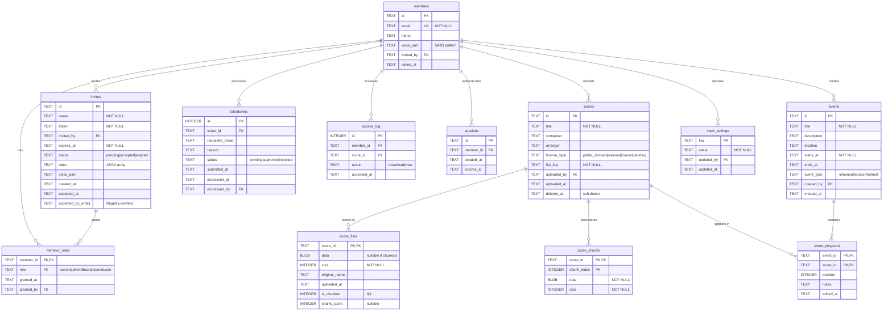

# Database Schema

Vault D1 database schema (SQLite). Current state after migration 0001 (consolidated).

## Entity-Relationship Diagram

## Tables

### Core Entities

#### members

Vault members (authenticated users).

| Column     | Type | Constraints      | Description                                            |
| ---------- | ---- | ---------------- | ------------------------------------------------------ |
| id         | TEXT | PK               | Unique member ID                                       |
| email      | TEXT | NOT NULL, UNIQUE | Email from Registry                                    |
| name       | TEXT |                  | Display name                                           |
| voice_part | TEXT | CHECK            | Voice section: `[SATB]{1,4}` (e.g., `S`, `AT`, `SATB`) |
| invited_by | TEXT | FK → members(id) | Who invited this member                                |
| joined_at  | TEXT | DEFAULT now()    | Timestamp                                              |

**Indexes:** None additional (PK on id, UNIQUE on email)

---

#### member_roles

Multi-role support via junction table.

| Column     | Type | Constraints          | Description                                    |
| ---------- | ---- | -------------------- | ---------------------------------------------- |
| member_id  | TEXT | PK, FK → members(id) | Member reference                               |
| role       | TEXT | PK, CHECK            | `owner`, `admin`, `librarian`, `conductor`     |
| granted_at | TEXT | DEFAULT now()        | When role assigned                             |
| granted_by | TEXT | FK → members(id)     | Who granted role                               |

**Indexes:**

- `idx_member_roles_member` on member_id
- `idx_member_roles_role` on role

**Constraints:**

- At least one owner must exist (application logic)
- Owner role is protected (cannot remove last owner)

---

#### scores

Sheet music metadata.

| Column       | Type | Constraints      | Description                                     |
| ------------ | ---- | ---------------- | ----------------------------------------------- |
| id           | TEXT | PK               | Unique score ID                                 |
| title        | TEXT | NOT NULL         | Score title                                     |
| composer     | TEXT |                  | Composer name                                   |
| arranger     | TEXT |                  | Arranger name                                   |
| license_type | TEXT | CHECK            | `public_domain`, `licensed`, `owned`, `pending` |
| file_key     | TEXT | NOT NULL         | Storage key (legacy, unused with D1)            |
| uploaded_by  | TEXT | FK → members(id) | Uploader                                        |
| uploaded_at  | TEXT | DEFAULT now()    | Upload timestamp                                |
| deleted_at   | TEXT |                  | Soft delete timestamp                           |

**Indexes:** None additional

---

#### score_files

PDF metadata and single-row storage (≤2MB files).

| Column        | Type    | Constraints         | Description                           |
| ------------- | ------- | ------------------- | ------------------------------------- |
| score_id      | TEXT    | PK, FK → scores(id) | Score reference                       |
| data          | BLOB    |                     | PDF binary (NULL if `is_chunked=1`)   |
| size          | INTEGER | NOT NULL            | Total file size in bytes              |
| original_name | TEXT    |                     | Original filename                     |
| uploaded_at   | TEXT    | DEFAULT now()       | Upload timestamp                      |
| is_chunked    | INTEGER | NOT NULL, DEFAULT 0 | 0=single row, 1=chunked               |
| chunk_count   | INTEGER |                     | Number of chunks (NULL if single row) |

**Indexes:** None additional (PK on score_id)

---

#### score_chunks

Large file storage (>2MB files split into chunks).

| Column      | Type    | Constraints         | Description                |
| ----------- | ------- | ------------------- | -------------------------- |
| score_id    | TEXT    | PK, FK → scores(id) | Score reference            |
| chunk_index | INTEGER | PK                  | Chunk number (0-based)     |
| data        | BLOB    | NOT NULL            | Chunk binary data (~1.9MB) |
| size        | INTEGER | NOT NULL            | Chunk size in bytes        |

**Indexes:**

- `idx_score_chunks_score_id` on score_id

**Chunking Strategy:**

- Files ≤2MB: Single row in `score_files` (`data` filled, `is_chunked=0`)
- Files >2MB: Metadata row in `score_files` (`data=NULL`, `is_chunked=1`) + N rows in `score_chunks`
- Chunk size: ~1.9MB (safely under D1's 2MB row limit)
- Max file size: ~9.5MB (5 chunks × 1.9MB)

---

### Supporting Tables

#### invites

Pending member invitations (name-based, multi-role support).

| Column             | Type | Constraints      | Description                                   |
| ------------------ | ---- | ---------------- | --------------------------------------------- |
| id                 | TEXT | PK               | Invite ID                                     |
| name               | TEXT | NOT NULL         | Invitee name (tracking only, not verified)    |
| token              | TEXT | NOT NULL, UNIQUE | Secret invite token                           |
| invited_by         | TEXT | FK → members(id) | Inviter                                       |
| expires_at         | TEXT | NOT NULL         | Expiration timestamp (48h default)            |
| status             | TEXT | CHECK            | `pending`, `accepted`, `expired`              |
| roles              | TEXT | NOT NULL         | JSON array of roles to grant                  |
| voice_part         | TEXT | CHECK            | Voice part: `[SATB]{1,4}`                     |
| created_at         | TEXT | DEFAULT now()    | Created timestamp                             |
| accepted_at        | TEXT |                  | Acceptance timestamp                          |
| accepted_by_email  | TEXT |                  | Registry-verified email (filled on acceptance)|

**Indexes:**

- `idx_invites_token` on token
- `idx_invites_status` on status

**Notes:**

- Email comes from Registry OAuth on acceptance (not stored in invite)
- Multiple roles can be assigned via JSON array (migration 0008)
- Name-based tracking (migration 0009)

---

#### sessions

Authentication sessions.

| Column     | Type | Constraints      | Description      |
| ---------- | ---- | ---------------- | ---------------- |
| id         | TEXT | PK               | Session ID       |
| member_id  | TEXT | FK → members(id) | Member reference |
| created_at | TEXT | DEFAULT now()    | Session start    |
| expires_at | TEXT |                  | Session expiry   |

**Indexes:**

- `idx_sessions_member` on member_id

---

#### takedowns

Copyright takedown requests.

| Column          | Type    | Constraints      | Description                       |
| --------------- | ------- | ---------------- | --------------------------------- |
| id              | INTEGER | PK AUTOINCREMENT | Takedown ID                       |
| score_id        | TEXT    | FK → scores(id)  | Target score                      |
| requester_email | TEXT    |                  | Requester contact                 |
| reason          | TEXT    |                  | Takedown reason                   |
| status          | TEXT    | CHECK            | `pending`, `approved`, `rejected` |
| submitted_at    | TEXT    | DEFAULT now()    | Submission timestamp              |
| processed_at    | TEXT    |                  | Processing timestamp              |
| processed_by    | TEXT    | FK → members(id) | Admin who processed               |

**Indexes:**

- `idx_takedowns_score` on score_id
- `idx_takedowns_status` on status

---

#### access_log

Audit trail for score access.

| Column      | Type    | Constraints      | Description        |
| ----------- | ------- | ---------------- | ------------------ |
| id          | INTEGER | PK AUTOINCREMENT | Log entry ID       |
| member_id   | TEXT    | FK → members(id) | Accessor           |
| score_id    | TEXT    | FK → scores(id)  | Accessed score     |
| action      | TEXT    |                  | `download`, `view` |
| accessed_at | TEXT    | DEFAULT now()    | Access timestamp   |

**Indexes:**

- `idx_access_log_member` on member_id
- `idx_access_log_score` on score_id

---

#### vault_settings

Configuration settings for the vault (key-value store with audit trail).

| Column     | Type | Constraints      | Description                    |
| ---------- | ---- | ---------------- | ------------------------------ |
| key        | TEXT | PK               | Setting key                    |
| value      | TEXT | NOT NULL         | Setting value                  |
| updated_by | TEXT | FK → members(id) | Member who last updated        |
| updated_at | TEXT | DEFAULT now()    | Last update timestamp          |

**Indexes:** None additional

**Default settings** (migration 0010):

- `default_voice_part`: ''
- `default_event_duration`: '120' (minutes)
- `conductor_id`: ''

---

### Event Management

#### events

Rehearsals, concerts, and other choir events.

| Column      | Type | Constraints      | Description                                 |
| ----------- | ---- | ---------------- | ------------------------------------------- |
| id          | TEXT | PK               | Event ID                                    |
| title       | TEXT | NOT NULL         | Event title                                 |
| description | TEXT |                  | Event description                           |
| location    | TEXT |                  | Event location                              |
| starts_at   | TEXT | NOT NULL         | Start datetime (ISO 8601)                   |
| ends_at     | TEXT |                  | End datetime (ISO 8601)                     |
| event_type  | TEXT | CHECK            | `rehearsal`, `concert`, `retreat`           |
| created_by  | TEXT | FK → members(id) | Creator                                     |
| created_at  | TEXT | DEFAULT now()    | Creation timestamp                          |

**Indexes:**

- `idx_events_starts_at` on starts_at
- `idx_events_type` on event_type

---

#### event_programs

Setlists linking scores to events in order.

| Column   | Type    | Constraints                                     | Description                    |
| -------- | ------- | ----------------------------------------------- | ------------------------------ |
| event_id | TEXT    | PK, FK → events(id) ON DELETE CASCADE           | Event reference                |
| score_id | TEXT    | PK, FK → scores(id) ON DELETE CASCADE           | Score reference                |
| position | INTEGER | NOT NULL, DEFAULT 0                             | Order in program (0-based)     |
| notes    | TEXT    |                                                 | Notes about this piece         |
| added_at | TEXT    | DEFAULT now()                                   | When added to program          |

**Indexes:**

- `idx_event_programs_event` on event_id
- `idx_event_programs_score` on score_id

**Constraints:**

- Composite primary key (event_id, score_id) prevents duplicate scores in same event

---

## Key Relationships

### Member → Roles (Many-to-Many)

A member can have multiple roles (owner, admin, librarian). Authenticated membership implies basic "singer" permissions (view/download).

### Member → Scores (One-to-Many)

Each score is uploaded by one member. Members can upload multiple scores (if they have librarian role).

### Score → Files (One-to-One with Optional Chunks)

Each score has 1 metadata row in `score_files`. Large files (>2MB) also have N rows in `score_chunks`.

### Member → Invites (One-to-Many)

A member (admin/owner) can send multiple invitations. Invites create new members when accepted. Invites are name-based and can grant multiple roles via JSON array (migrations 0008-0009).

### Member → Events (One-to-Many)

Each event is created by one member (with conductor/owner role). Members can create multiple events.

### Event → Programs (One-to-Many)

Each event has one program (setlist) with multiple scores. Scores are ordered by position.

## Data Constraints

### Voice Part Pattern

`voice_part` must match: `[SATB]{1,4}` (1-4 characters, only S/A/T/B)

- Valid: `S`, `AT`, `SATB`, `TB`
- Invalid: `SS`, `X`, `SATBR`

### License Types

- `public_domain` - No restrictions
- `licensed` - Licensed for use
- `owned` - Owned by choir
- `pending` - Rights verification pending

### Role Types

- `owner` - Vault superuser (protected, at least 1 required)
- `admin` - Member management
- `librarian` - Score management
- `conductor` - Event and attendance management (added migration 0011)

### Event Types

- `rehearsal` - Regular practice session
- `concert` - Performance event
- `retreat` - Multi-day gathering

### Invite Status

- `pending` - Invite created, not yet accepted
- `accepted` - Invite used to create member
- `expired` - Invite past expiration date

## Migration History

| Migration | Description                                                |
| --------- | ---------------------------------------------------------- |
| **0001**  | **Complete schema** - Consolidated from production state (2026-01-26). Includes all tables: members, member_roles, scores, score_files, score_chunks, invites, sessions, takedowns, access_log, vault_settings, events, event_programs. Replaces broken incremental migrations. |

**Note**: Previous migrations (0001-0012) were consolidated into a single migration on 2026-01-26 due to schema drift between development history and production state. The new 0001_complete_schema.sql represents the verified working state and is fully replayable from scratch.

## See Also

- [roles.md](../apps/vault/docs/roles.md) - Role definitions and permissions
- [migrations/](../apps/vault/migrations/) - SQL migration files
- TypeScript interfaces: `apps/vault/src/lib/server/db/members.ts`
