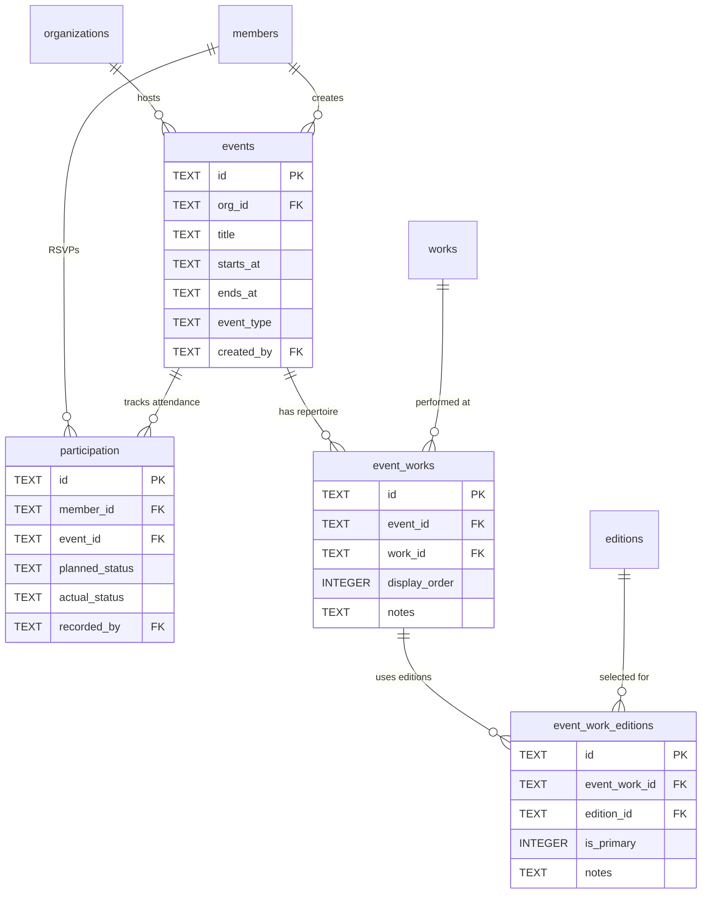

# Event Management

#### events

Rehearsals, concerts, and other choir events. **Schema V2: Per-organization.**

| Column      | Type | Constraints                    | Description                                   |
| ----------- | ---- | ------------------------------ | --------------------------------------------- |
| id          | TEXT | PK                                       | Event ID                                      |
| org_id      | TEXT | NOT NULL, FK → organizations(id) CASCADE | Organization owner (Schema V2, NOT NULL since 0042) |
| title       | TEXT | NOT NULL                                 | Event title                                   |
| description | TEXT |                                | Event description                             |
| location    | TEXT |                                | Event location                                |
| starts_at   | TEXT | NOT NULL                       | Start datetime (ISO 8601)                     |
| ends_at     | TEXT |                                | End datetime (ISO 8601)                       |
| event_type  | TEXT | CHECK                          | `rehearsal`, `concert`, `retreat`, `festival` |
| created_by  | TEXT | FK → members(id)               | Creator                                       |
| created_at  | TEXT | DEFAULT now()                  | Creation timestamp                            |

**Indexes:**

- `idx_events_starts_at` on starts_at
- `idx_events_type` on event_type
- `idx_events_org` on org_id

---

#### event_works

Works assigned to an event (event repertoire).

| Column        | Type    | Constraints                         | Description           |
| ------------- | ------- | ----------------------------------- | --------------------- |
| id            | TEXT    | PK                                  | Assignment ID         |
| event_id      | TEXT    | FK → events(id) ON DELETE CASCADE   | Event reference       |
| work_id       | TEXT    | FK → works(id) ON DELETE CASCADE    | Work reference        |
| display_order | INTEGER | NOT NULL, DEFAULT 0                 | Order in repertoire   |
| notes         | TEXT    |                                     | Notes about this work |
| added_at      | TEXT    | DEFAULT now()                       | When added            |
| added_by      | TEXT    | FK → members(id) ON DELETE SET NULL | Who added it          |

**Indexes:**

- `idx_event_works_event` on (event_id, display_order)
- `idx_event_works_work` on work_id

**Constraints:**

- UNIQUE(event_id, work_id) prevents duplicate works in same event

---

#### event_work_editions

Editions selected for each event-work pairing.

| Column        | Type    | Constraints                            | Description              |
| ------------- | ------- | -------------------------------------- | ------------------------ |
| id            | TEXT    | PK                                     | Assignment ID            |
| event_work_id | TEXT    | FK → event_works(id) ON DELETE CASCADE | Event-work reference     |
| edition_id    | TEXT    | FK → editions(id) ON DELETE CASCADE    | Edition reference        |
| is_primary    | INTEGER | NOT NULL, DEFAULT 0                    | Mark the main edition    |
| notes         | TEXT    |                                        | Notes about this edition |
| added_at      | TEXT    | DEFAULT now()                          | When added               |
| added_by      | TEXT    | FK → members(id) ON DELETE SET NULL    | Who added it             |

**Indexes:**

- `idx_event_work_editions_ew` on event_work_id
- `idx_event_work_editions_edition` on edition_id

**Constraints:**

- UNIQUE(event_work_id, edition_id) prevents duplicate editions per event-work

---

#### participation

RSVP and attendance tracking for events.

| Column         | Type | Constraints                          | Description                                |
| -------------- | ---- | ------------------------------------ | ------------------------------------------ |
| id             | TEXT | PK                                   | Participation record ID                    |
| member_id      | TEXT | NOT NULL, FK → members(id) CASCADE   | Member reference                           |
| event_id       | TEXT | NOT NULL, FK → events(id) CASCADE    | Event reference                            |
| planned_status | TEXT | CHECK (`yes`, `no`, `maybe`, `late`) | Member's RSVP response                     |
| planned_at     | TEXT |                                      | When RSVP was set                          |
| planned_notes  | TEXT |                                      | Optional notes with RSVP                   |
| actual_status  | TEXT | CHECK (`present`, `absent`, `late`)  | Conductor-recorded attendance              |
| recorded_at    | TEXT |                                      | When attendance was recorded               |
| recorded_by    | TEXT | FK → members(id)                     | Who recorded attendance (conductor/leader) |
| created_at     | TEXT | NOT NULL, DEFAULT now()              | Record creation timestamp                  |
| updated_at     | TEXT | NOT NULL, DEFAULT now()              | Last update timestamp                      |

**Indexes:**

- `idx_participation_member` on member_id
- `idx_participation_event` on event_id
- `idx_participation_planned` on planned_status
- `idx_participation_actual` on actual_status

**Constraints:**

- `UNIQUE(member_id, event_id)` - One participation record per member per event

**Notes:**

- `planned_status` is set by member (self-service RSVP)
- `actual_status` is set by conductor or section leader (attendance recording)
- Both can be null: a member may not RSVP, or attendance may not be recorded yet
