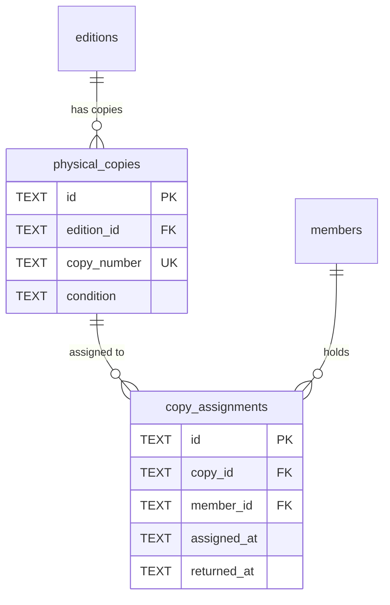

# Physical Inventory

#### physical_copies

Individual numbered copies of editions in the choir's inventory.

| Column      | Type     | Constraints                         | Description                         |
| ----------- | -------- | ----------------------------------- | ----------------------------------- |
| id          | TEXT     | PK                                  | Copy ID                             |
| edition_id  | TEXT     | NOT NULL, FK → editions(id) CASCADE | Parent edition                      |
| copy_number | TEXT     | NOT NULL                            | Copy identifier (e.g., "1", "M-01") |
| condition   | TEXT     | DEFAULT 'good', CHECK               | `good`, `fair`, `poor`, `lost`      |
| acquired_at | DATE     |                                     | When acquired                       |
| notes       | TEXT     |                                     | Notes about this copy               |
| created_at  | DATETIME | DEFAULT now()                       | Creation timestamp                  |

**Indexes:**

- `idx_physical_copies_edition` on edition_id
- `idx_physical_copies_condition` on condition

**Constraints:**

- UNIQUE(edition_id, copy_number) - Copy numbers unique within edition

---

#### copy_assignments

Tracks who has which physical copy (check-out/return workflow).

| Column      | Type | Constraints                                | Description                         |
| ----------- | ---- | ------------------------------------------ | ----------------------------------- |
| id          | TEXT | PK                                         | Assignment ID                       |
| copy_id     | TEXT | NOT NULL, FK → physical_copies(id) CASCADE | Copy being assigned                 |
| member_id   | TEXT | NOT NULL, FK → members(id) CASCADE         | Member receiving copy               |
| assigned_at | TEXT | NOT NULL, DEFAULT now()                    | Check-out timestamp                 |
| assigned_by | TEXT | FK → members(id) ON DELETE SET NULL        | Librarian who assigned              |
| returned_at | TEXT |                                            | Return timestamp (NULL = still out) |
| notes       | TEXT |                                            | Assignment notes                    |
| created_at  | TEXT | NOT NULL, DEFAULT now()                    | Record creation timestamp           |

**Indexes:**

- `idx_copy_assignments_copy_id` on copy_id
- `idx_copy_assignments_member_id` on member_id
- `idx_copy_assignments_active` PARTIAL on copy_id WHERE returned_at IS NULL

**Notes:**

- Active assignment: `returned_at IS NULL`
- History preserved: Multiple assignments per copy over time
- Partial index optimizes "is this copy currently assigned?" queries
