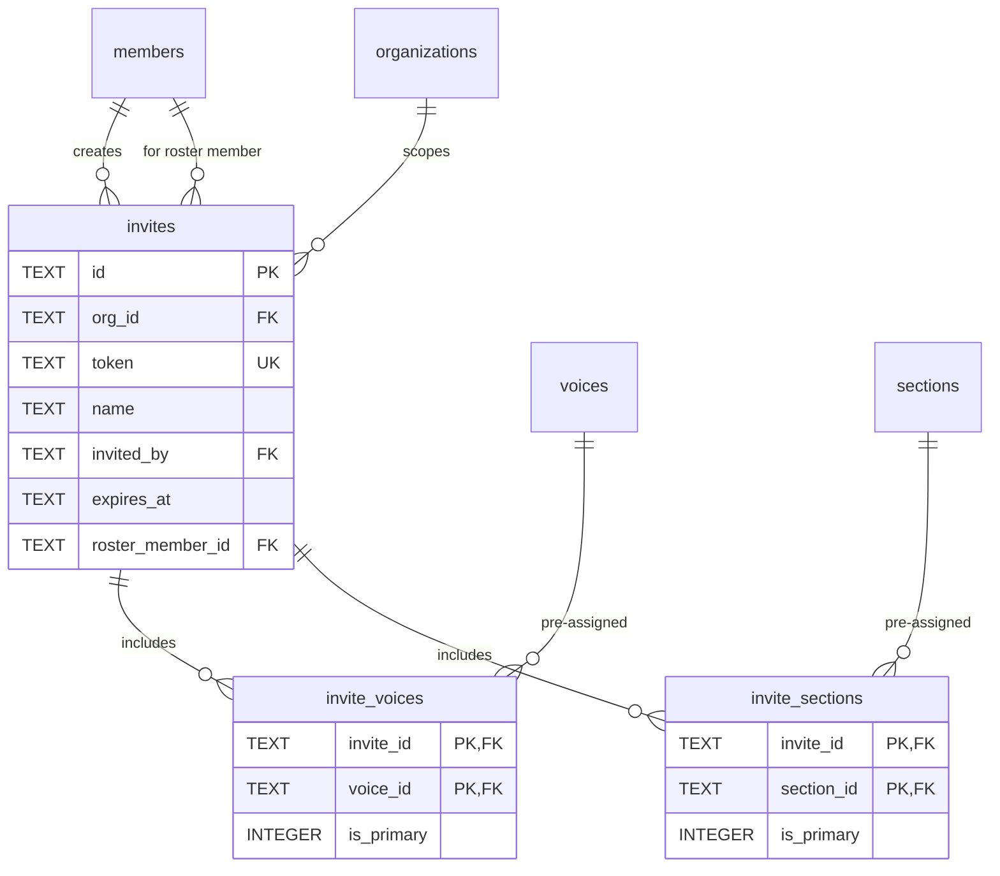

# Invitations

#### invites

Pending member invitations (name-based, with optional pre-assigned voices/sections). **Schema V2: Per-organization.**

| Column           | Type | Constraints                    | Description                             |
| ---------------- | ---- | ------------------------------ | --------------------------------------- |
| id               | TEXT | PK                                       | Invite ID                               |
| org_id           | TEXT | NOT NULL, FK → organizations(id) CASCADE | Organization scope (Schema V2, NOT NULL since 0042) |
| token            | TEXT | NOT NULL, UNIQUE               | Secret invite token                     |
| name             | TEXT | NOT NULL                       | Invitee name (tracking only)            |
| invited_by       | TEXT | NOT NULL, FK → members(id)     | Inviter                                 |
| created_at       | TEXT | NOT NULL, DEFAULT now()        | Created timestamp                       |
| expires_at       | TEXT | NOT NULL                       | Expiration timestamp (48h default)      |
| roster_member_id | TEXT | FK → members(id)               | Optional link to existing roster member |

**Indexes:**

- `idx_invites_org` on org_id
- `sqlite_autoindex_invites_1` on id (PK)
- `sqlite_autoindex_invites_2` on token (UNIQUE)

**Notes:**

- Simplified schema - roles are assigned after acceptance, not stored in invite
- `roster_member_id` links to existing roster-only member for upgrade workflow
- Voices and sections are stored in `invite_voices` and `invite_sections` junction tables
- On acceptance, voices/sections are transferred to `member_voices` and `member_sections`

---

#### invite_voices

Junction table: voices to assign when invite is accepted.

| Column     | Type    | Constraints                            | Description                    |
| ---------- | ------- | -------------------------------------- | ------------------------------ |
| invite_id  | TEXT    | PK, FK → invites(id) ON DELETE CASCADE | Invite reference               |
| voice_id   | TEXT    | PK, FK → voices(id) ON DELETE CASCADE  | Voice reference                |
| is_primary | INTEGER | NOT NULL, DEFAULT 0                    | Will be primary for new member |

**Indexes:**

- `idx_invite_voices_invite` on invite_id

---

#### invite_sections

Junction table: sections to assign when invite is accepted.

| Column     | Type    | Constraints                             | Description                    |
| ---------- | ------- | --------------------------------------- | ------------------------------ |
| invite_id  | TEXT    | PK, FK → invites(id) ON DELETE CASCADE  | Invite reference               |
| section_id | TEXT    | PK, FK → sections(id) ON DELETE CASCADE | Section reference              |
| is_primary | INTEGER | NOT NULL, DEFAULT 0                     | Will be primary for new member |

**Indexes:**

- `idx_invite_sections_invite` on invite_id
