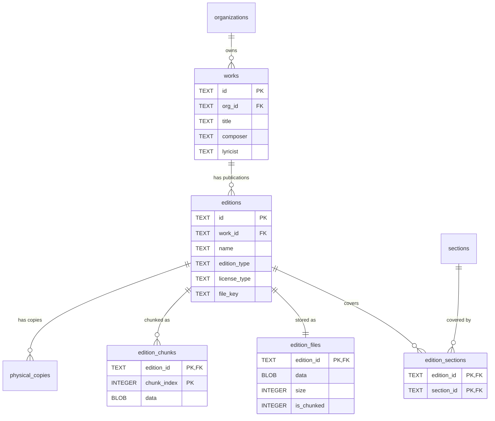

# Score Library

#### works

Abstract musical compositions (independent of specific publications). **Schema V2: Per-organization.**

| Column     | Type | Constraints                    | Description                    |
| ---------- | ---- | ------------------------------ | ------------------------------ |
| id         | TEXT | PK                                       | Work ID                        |
| org_id     | TEXT | NOT NULL, FK → organizations(id) CASCADE | Organization owner (Schema V2, NOT NULL since 0042) |
| title      | TEXT | NOT NULL                                 | Composition title              |
| composer   | TEXT |                                | Composer name                  |
| lyricist   | TEXT |                                | Lyricist/librettist            |
| created_at | TEXT | DEFAULT now()                  | Creation timestamp             |

**Indexes:**

- `idx_works_title` on title
- `idx_works_composer` on composer
- `idx_works_org` on org_id

---

#### editions

Specific publications or arrangements of a work.

| Column           | Type     | Constraints                      | Description                             |
| ---------------- | -------- | -------------------------------- | --------------------------------------- |
| id               | TEXT     | PK                               | Edition ID                              |
| work_id          | TEXT     | NOT NULL, FK → works(id) CASCADE | Parent work                             |
| name             | TEXT     | NOT NULL                         | Edition name (e.g., "Novello Vocal")    |
| arranger         | TEXT     |                                  | Arranger name                           |
| publisher        | TEXT     |                                  | Publisher name                          |
| voicing          | TEXT     |                                  | Voice arrangement (e.g., "SATB")        |
| edition_type     | TEXT     | NOT NULL, DEFAULT 'vocal_score'  | See Edition Types below                 |
| license_type     | TEXT     | NOT NULL, DEFAULT 'owned'        | `public_domain`, `licensed`, `owned`    |
| notes            | TEXT     |                                  | Internal notes                          |
| external_url     | TEXT     |                                  | Link to external resource (IMSLP, etc.) |
| file_key         | TEXT     |                                  | Storage key (if uploaded)               |
| file_name        | TEXT     |                                  | Original filename                       |
| file_size        | INTEGER  |                                  | File size in bytes                      |
| file_uploaded_at | DATETIME |                                  | Upload timestamp                        |
| file_uploaded_by | TEXT     | FK → members(id)                 | Who uploaded                            |
| created_at       | DATETIME | DEFAULT now()                    | Creation timestamp                      |

**Indexes:**

- `idx_editions_work_id` on work_id
- `idx_editions_edition_type` on edition_type

**Edition Types:**

- `full_score` - Conductor's score with all parts
- `vocal_score` - Voice parts with piano reduction
- `part` - Individual instrumental part
- `reduction` - Simplified arrangement
- `audio` - Audio recording
- `video` - Video recording
- `supplementary` - Supporting materials

---

#### edition_sections

Junction table: which sections an edition covers (for coverage validation).

| Column     | Type | Constraints                             | Description       |
| ---------- | ---- | --------------------------------------- | ----------------- |
| edition_id | TEXT | PK, FK → editions(id) ON DELETE CASCADE | Edition reference |
| section_id | TEXT | PK, FK → sections(id) ON DELETE CASCADE | Section reference |

**Indexes:**

- `idx_edition_sections_section_id` on section_id

---

#### edition_files

PDF metadata and single-row storage (≤2MB files).

| Column        | Type    | Constraints                             | Description                           |
| ------------- | ------- | --------------------------------------- | ------------------------------------- |
| edition_id    | TEXT    | PK, FK → editions(id) ON DELETE CASCADE | Edition reference                     |
| data          | BLOB    |                                         | PDF binary (NULL if `is_chunked=1`)   |
| size          | INTEGER | NOT NULL                                | Total file size in bytes              |
| original_name | TEXT    |                                         | Original filename                     |
| uploaded_at   | TEXT    | DEFAULT now()                           | Upload timestamp                      |
| is_chunked    | INTEGER | NOT NULL, DEFAULT 0                     | 0=single row, 1=chunked               |
| chunk_count   | INTEGER |                                         | Number of chunks (NULL if single row) |

---

#### edition_chunks

Large file storage (>2MB files split into chunks).

| Column      | Type    | Constraints                             | Description                |
| ----------- | ------- | --------------------------------------- | -------------------------- |
| edition_id  | TEXT    | PK, FK → editions(id) ON DELETE CASCADE | Edition reference          |
| chunk_index | INTEGER | PK                                      | Chunk number (0-based)     |
| data        | BLOB    | NOT NULL                                | Chunk binary data (~1.9MB) |
| size        | INTEGER | NOT NULL                                | Chunk size in bytes        |

**Indexes:**

- `idx_edition_chunks_edition_id` on edition_id

**Chunking Strategy:**

- Files ≤2MB: Single row in `edition_files` (`data` filled, `is_chunked=0`)
- Files >2MB: Metadata row in `edition_files` (`data=NULL`, `is_chunked=1`) + N rows in `edition_chunks`
- Chunk size: ~1.9MB (safely under D1's 2MB row limit)
- Max file size: ~9.5MB (5 chunks × 1.9MB)
