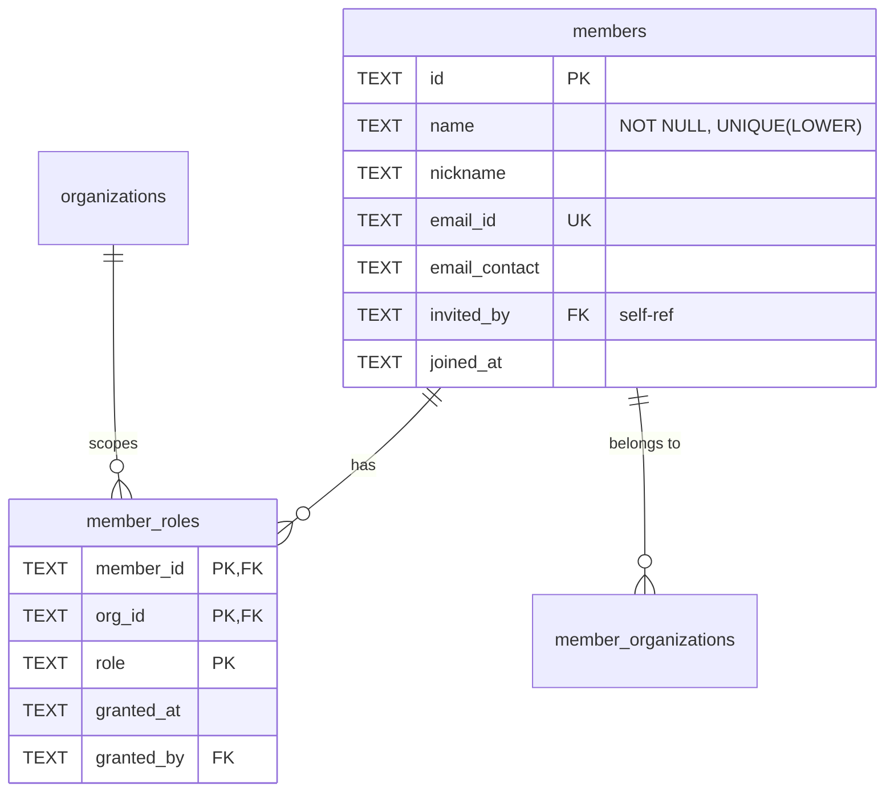

# Core Entities

#### members

Vault members. Can be roster-only (no email_id) or registered via OAuth (has email_id).

| Column        | Type | Constraints              | Description                                 |
| ------------- | ---- | ------------------------ | ------------------------------------------- |
| id            | TEXT | PK                       | Unique member ID                            |
| name          | TEXT | NOT NULL, UNIQUE (LOWER) | Display name (case-insensitive unique)      |
| nickname      | TEXT |                          | Compact display name for roster             |
| email_id      | TEXT | UNIQUE WHERE NOT NULL    | OAuth identity email (null for roster-only) |
| email_contact | TEXT |                          | Contact preference (optional)               |
| invited_by    | TEXT | FK → members(id)         | Who invited this member                     |
| joined_at     | TEXT | DEFAULT now()            | Timestamp                                   |

**Indexes:**

- `idx_members_name_lower` ~~UNIQUE~~ on LOWER(name) — **dropped in migration 0035** (name uniqueness now per-org via application logic)
- `idx_members_email_id` UNIQUE on email_id WHERE email_id IS NOT NULL
- `idx_members_nickname` on nickname WHERE nickname IS NOT NULL

**Note:** Voice capabilities and section assignments are stored in junction tables `member_voices` and `member_sections`. Roster-only members (email_id IS NULL) can be upgraded to registered by setting email_id via invite acceptance.

---

#### member_roles

Multi-role support via junction table. **Schema V2: Roles are org-scoped.**

| Column     | Type | Constraints                            | Description                                                  |
| ---------- | ---- | -------------------------------------- | ------------------------------------------------------------ |
| member_id  | TEXT | PK, FK → members(id) ON DELETE CASCADE | Member reference                                             |
| org_id     | TEXT | PK, FK → organizations(id) CASCADE     | Organization scope (Schema V2)                               |
| role       | TEXT | PK, CHECK                              | `owner`, `admin`, `librarian`, `conductor`, `section_leader` |
| granted_at | TEXT | DEFAULT now()                          | When role assigned                                           |
| granted_by | TEXT | FK → members(id)                       | Who granted role                                             |

**Indexes:**

- `idx_member_roles_org` on org_id
- `idx_member_roles_member` on member_id
- `idx_member_roles_role` on role

**Constraints:**

- At least one owner must exist per organization (application logic)
- Owner role is protected (cannot remove last owner)
