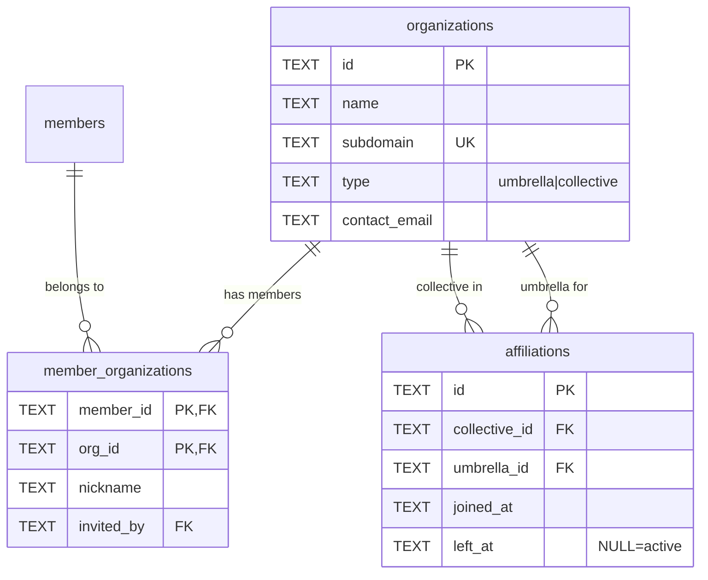

# Organizations (Schema V2)

#### organizations

Multi-organization support. Umbrellas contain collectives (choirs).

| Column        | Type | Constraints      | Description                |
| ------------- | ---- | ---------------- | -------------------------- |
| id            | TEXT | PK               | Organization ID            |
| name          | TEXT | NOT NULL         | Display name               |
| subdomain     | TEXT | NOT NULL, UNIQUE | URL subdomain (routing)    |
| type          | TEXT | NOT NULL, CHECK  | `umbrella` or `collective` |
| contact_email | TEXT | NOT NULL         | Contact email              |
| created_at    | TEXT | DEFAULT now()    | Creation timestamp         |

**Indexes:**

- `idx_organizations_subdomain` on subdomain
- `idx_organizations_type` on type

**Organization Types:**

- `umbrella` - Organization containing other organizations (e.g., Estonian Choral Association)
- `collective` - Regular choir (most common)

---

#### member_organizations

Junction table linking members to organizations with org-specific data.

| Column     | Type | Constraints                            | Description               |
| ---------- | ---- | -------------------------------------- | ------------------------- |
| member_id  | TEXT | PK, FK → members(id) ON DELETE CASCADE | Member reference          |
| org_id     | TEXT | PK, FK → organizations(id) CASCADE     | Organization reference    |
| nickname   | TEXT |                                        | Org-specific display name |
| invited_by | TEXT | FK → members(id) ON DELETE SET NULL    | Who invited to this org   |
| joined_at  | TEXT | NOT NULL, DEFAULT now()                | When joined this org      |

**Indexes:**

- `idx_member_orgs_org` on org_id
- `idx_member_orgs_member` on member_id

---

#### affiliations

Tracks collective ↔ umbrella relationships with history.

| Column        | Type | Constraints                              | Description                |
| ------------- | ---- | ---------------------------------------- | -------------------------- |
| id            | TEXT | PK                                       | Affiliation ID             |
| collective_id | TEXT | NOT NULL, FK → organizations(id) CASCADE | Child collective           |
| umbrella_id   | TEXT | NOT NULL, FK → organizations(id) CASCADE | Parent umbrella            |
| joined_at     | TEXT | NOT NULL, DEFAULT now()                  | When affiliation started   |
| left_at       | TEXT |                                          | When ended (NULL = active) |

**Indexes:**

- `idx_affiliations_active` UNIQUE PARTIAL on (collective_id, umbrella_id) WHERE left_at IS NULL
- `idx_affiliations_collective` on collective_id
- `idx_affiliations_umbrella` on umbrella_id

**Constraints:**

- UNIQUE(collective_id, umbrella_id, joined_at) - History uniqueness
- Partial unique index ensures only one ACTIVE affiliation per collective-umbrella pair
