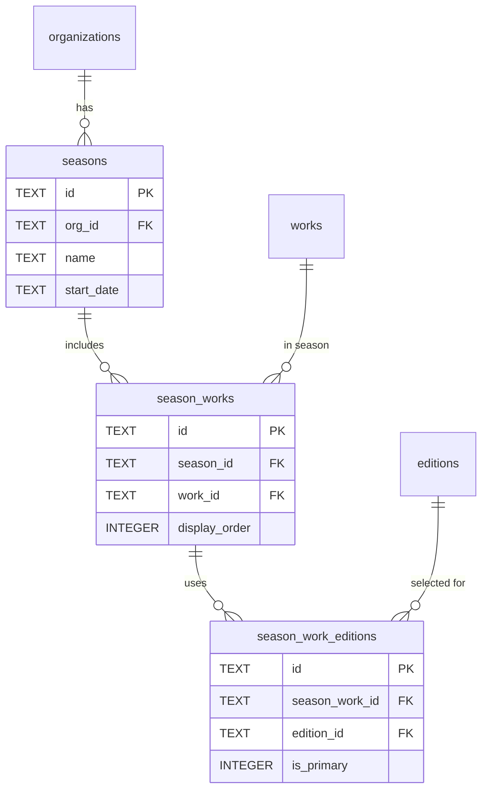

# Seasons and Repertoire

#### seasons

Date-based groupings for repertoire organization. **Schema V2: Per-organization.**

| Column     | Type | Constraints                              | Description                     |
| ---------- | ---- | ---------------------------------------- | ------------------------------- |
| id         | TEXT | PK                                       | Season ID                       |
| org_id     | TEXT | NOT NULL, FK → organizations(id) CASCADE | Organization owner (Schema V2)  |
| name       | TEXT | NOT NULL                                 | Season name (e.g., "Fall 2026") |
| start_date | TEXT | NOT NULL                                 | Start date (YYYY-MM-DD)         |
| created_at | TEXT | NOT NULL, DEFAULT now()                  | Creation timestamp              |
| updated_at | TEXT | NOT NULL, DEFAULT now()                  | Last update timestamp           |

**Indexes:**

- `idx_seasons_start_date` on start_date
- `idx_seasons_org` on org_id

**Constraints:**

- UNIQUE(org_id, start_date) - One season per start date per organization

**Notes:**

- Events belong to seasons by date, not explicit FK
- Query: `SELECT * FROM seasons WHERE org_id = :org AND start_date <= :event_date ORDER BY start_date DESC LIMIT 1`

---

#### season_works

Works assigned to a season (season repertoire, ordered).

| Column        | Type    | Constraints                         | Description           |
| ------------- | ------- | ----------------------------------- | --------------------- |
| id            | TEXT    | PK                                  | Assignment ID         |
| season_id     | TEXT    | NOT NULL, FK → seasons(id) CASCADE  | Season reference      |
| work_id       | TEXT    | NOT NULL, FK → works(id) CASCADE    | Work reference        |
| display_order | INTEGER | NOT NULL, DEFAULT 0                 | Order in repertoire   |
| notes         | TEXT    |                                     | Notes about this work |
| added_at      | TEXT    | NOT NULL, DEFAULT now()             | When added            |
| added_by      | TEXT    | FK → members(id) ON DELETE SET NULL | Who added it          |

**Indexes:**

- `idx_season_works_season` on (season_id, display_order)
- `idx_season_works_work` on work_id

**Constraints:**

- UNIQUE(season_id, work_id) prevents duplicate works in same season

---

#### season_work_editions

Editions selected for each season-work pairing.

| Column         | Type    | Constraints                             | Description              |
| -------------- | ------- | --------------------------------------- | ------------------------ |
| id             | TEXT    | PK                                      | Assignment ID            |
| season_work_id | TEXT    | NOT NULL, FK → season_works(id) CASCADE | Season-work reference    |
| edition_id     | TEXT    | NOT NULL, FK → editions(id) CASCADE     | Edition reference        |
| is_primary     | INTEGER | NOT NULL, DEFAULT 0                     | Mark the main edition    |
| notes          | TEXT    |                                         | Notes about this edition |
| added_at       | TEXT    | NOT NULL, DEFAULT now()                 | When added               |
| added_by       | TEXT    | FK → members(id) ON DELETE SET NULL     | Who added it             |

**Indexes:**

- `idx_season_work_editions_sw` on season_work_id
- `idx_season_work_editions_edition` on edition_id

**Constraints:**

- UNIQUE(season_work_id, edition_id) prevents duplicate editions per season-work
