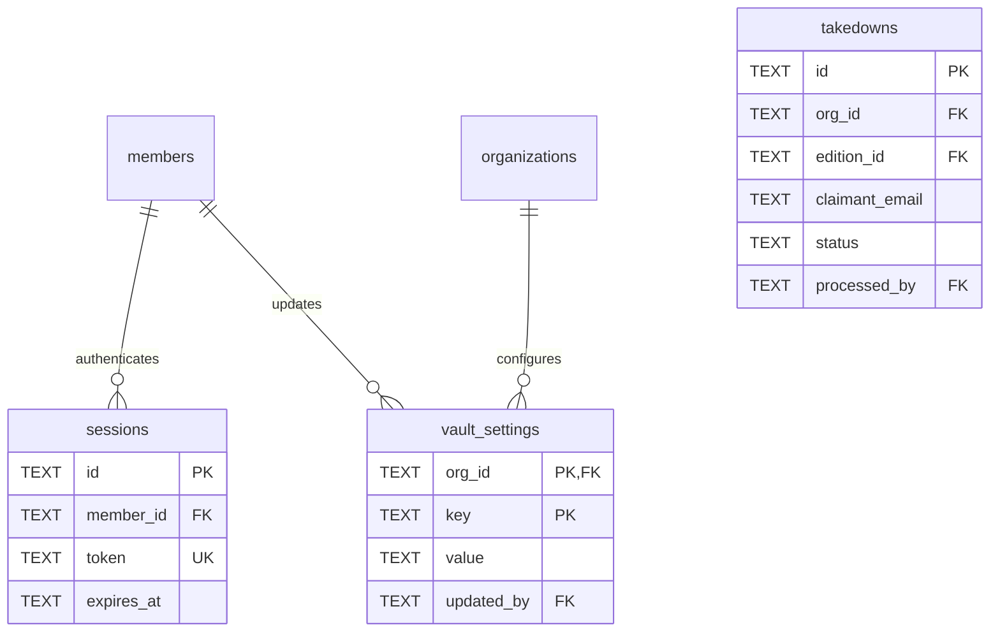

# Supporting Tables

#### sessions

Authentication sessions.

| Column     | Type | Constraints                        | Description      |
| ---------- | ---- | ---------------------------------- | ---------------- |
| id         | TEXT | PK                                 | Session ID       |
| member_id  | TEXT | NOT NULL, FK → members(id) CASCADE | Member reference |
| token      | TEXT | NOT NULL, UNIQUE                   | Session token    |
| expires_at | TEXT | NOT NULL                           | Session expiry   |
| created_at | TEXT | NOT NULL, DEFAULT now()            | Session start    |

**Indexes:**

- `sqlite_autoindex_sessions_1` on id (PK)
- `sqlite_autoindex_sessions_2` on token (UNIQUE)

---

#### takedowns

Copyright takedown requests (org-scoped, targets editions). **Schema V2: Per-organization.**

| Column           | Type    | Constraints                              | Description                       |
| ---------------- | ------- | ---------------------------------------- | --------------------------------- |
| id               | TEXT    | PK                                       | Takedown ID                       |
| org_id           | TEXT    | NOT NULL, FK → organizations(id) CASCADE | Organization scope (migration 0041) |
| edition_id       | TEXT    | NOT NULL, FK → editions(id)              | Target edition                    |
| claimant_name    | TEXT    | NOT NULL                                 | Claimant's name                   |
| claimant_email   | TEXT    | NOT NULL                                 | Claimant's email                  |
| reason           | TEXT    | NOT NULL                                 | Takedown reason                   |
| attestation      | INTEGER | NOT NULL, DEFAULT 0                      | Legal attestation checkbox        |
| status           | TEXT    | NOT NULL, DEFAULT 'pending', CHECK       | `pending`, `approved`, `rejected` |
| created_at       | TEXT    | NOT NULL, DEFAULT now()                  | Submission timestamp              |
| processed_at     | TEXT    |                                          | Processing timestamp              |
| processed_by     | TEXT    | FK → members(id)                         | Admin who processed               |
| resolution_notes | TEXT    |                                          | Notes about resolution            |

**Indexes:**

- `idx_takedowns_edition` on edition_id
- `idx_takedowns_org` on org_id
- `idx_takedowns_status` on status
- `idx_takedowns_created` on created_at DESC

---

#### vault_settings

Configuration settings per organization (key-value store with audit trail). **Schema V2: Per-organization.**

| Column     | Type | Constraints                              | Description                    |
| ---------- | ---- | ---------------------------------------- | ------------------------------ |
| org_id     | TEXT | PK, FK → organizations(id) CASCADE      | Organization scope (Schema V2) |
| key        | TEXT | PK                                       | Setting key                    |
| value      | TEXT | NOT NULL                                 | Setting value                  |
| updated_by | TEXT | FK → members(id) ON DELETE SET NULL      | Member who last updated        |
| updated_at | TEXT | NOT NULL, DEFAULT now()                  | Last update timestamp          |

**Indexes:** None additional

**Constraints:**

- PRIMARY KEY (org_id, key) - Settings are unique per organization

**Default settings:**

- `default_event_duration`: '120' (minutes)
