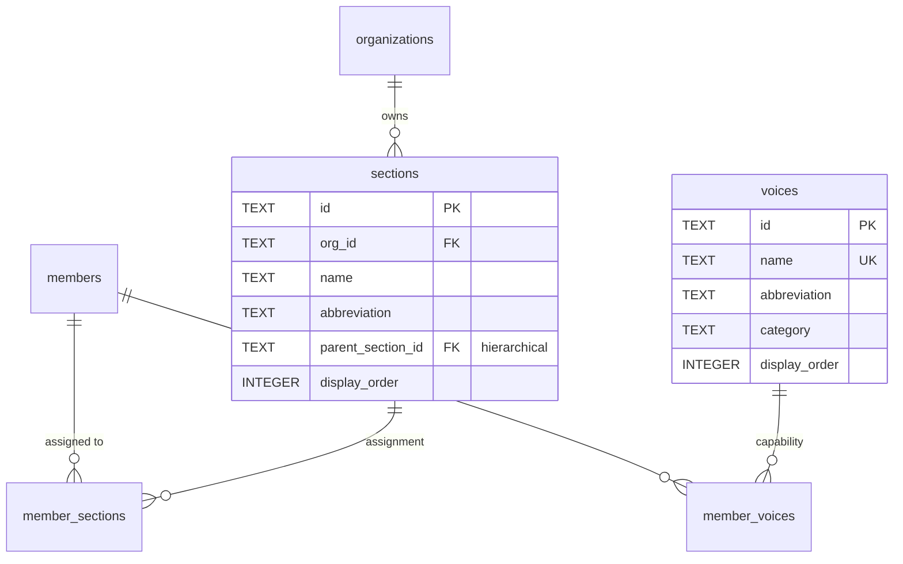

# Voices and Sections

#### voices

Vocal capabilities that members can have (what they CAN sing). **Per-organization (Schema V2, migration 0043).**

| Column        | Type    | Constraints                              | Description                                     |
| ------------- | ------- | ---------------------------------------- | ----------------------------------------------- |
| id            | TEXT    | PK                                       | Voice ID (e.g., 'org_crede_001_soprano')        |
| org_id        | TEXT    | NOT NULL, FK → organizations(id) CASCADE | Owning organization                             |
| name          | TEXT    | NOT NULL                                 | Display name                                    |
| abbreviation  | TEXT    | NOT NULL                                 | Short code (e.g., 'S', 'T')                     |
| category      | TEXT    | CHECK                                    | `vocal` or `instrumental`                       |
| range_group   | TEXT    |                                          | Grouping (soprano, alto, tenor, bass)           |
| display_order | INTEGER | NOT NULL                                 | Sort order for UI                               |
| is_active     | INTEGER | NOT NULL, DEFAULT 1                      | 0=hidden, 1=available                           |

**Constraints:** UNIQUE(org_id, name)

**Indexes:**

- `idx_voices_org` on org_id
- `idx_voices_category` on category
- `idx_voices_display_order` on display_order

**Triggers:**

- `enforce_single_primary_voice` — On INSERT to member_voices with is_primary=1, clears other primaries within the same org
- `enforce_single_primary_voice_update` — Same enforcement on UPDATE

**Seeded Data:** Each organization gets a copy of: Soprano, Alto, Tenor, Baritone, Bass (active); subdivisions like Soprano I, Soprano II (inactive by default)

---

#### sections

Performance assignments (where members DO sing). **Schema V2: Sections are per-organization.**

| Column            | Type    | Constraints                              | Description                             |
| ----------------- | ------- | ---------------------------------------- | --------------------------------------- |
| id                | TEXT    | PK                                       | Section ID (e.g., 'soprano', 'tenor-1') |
| org_id            | TEXT    | NOT NULL, FK → organizations(id) CASCADE | Organization owner (Schema V2)          |
| name              | TEXT    | NOT NULL                                 | Display name                            |
| abbreviation      | TEXT    | NOT NULL                                 | Short code (e.g., 'S', 'T1')            |
| parent_section_id | TEXT    | FK → sections(id)                        | Parent section for subdivisions         |
| display_order     | INTEGER | NOT NULL                                 | Sort order for UI                       |
| is_active         | INTEGER | NOT NULL, DEFAULT 1                      | 0=hidden, 1=available                   |

**Indexes:**

- `idx_sections_org` on org_id
- `idx_sections_display_order` on display_order

**Constraints:**

- UNIQUE(org_id, name) - Section names unique within organization

**Design Note:** Sections are per-org because Choir A's "T1" ≠ Choir B's "T1". Voices remain global because a singer's vocal capability is intrinsic.

---

#### member_voices

Junction table: which voices each member can sing.

| Column      | Type    | Constraints                            | Description                   |
| ----------- | ------- | -------------------------------------- | ----------------------------- |
| member_id   | TEXT    | PK, FK → members(id) ON DELETE CASCADE | Member reference              |
| voice_id    | TEXT    | PK, FK → voices(id) ON DELETE CASCADE  | Voice reference               |
| is_primary  | INTEGER | NOT NULL, DEFAULT 0, CHECK 0\|1        | Primary voice for this member |
| assigned_at | TEXT    | DEFAULT now()                          | When assigned                 |
| assigned_by | TEXT    | FK → members(id)                       | Who assigned                  |
| notes       | TEXT    |                                        | Optional notes                |

**Indexes:**

- `idx_member_voices_member` on member_id
- `idx_member_voices_voice` on voice_id
- `idx_member_voices_primary` on is_primary WHERE is_primary = 1

**Triggers:**

- `enforce_single_primary_voice` - Ensures only one primary voice per member

---

#### member_sections

Junction table: which sections each member is assigned to.

| Column      | Type    | Constraints                             | Description                     |
| ----------- | ------- | --------------------------------------- | ------------------------------- |
| member_id   | TEXT    | PK, FK → members(id) ON DELETE CASCADE  | Member reference                |
| section_id  | TEXT    | PK, FK → sections(id) ON DELETE CASCADE | Section reference               |
| is_primary  | INTEGER | NOT NULL, DEFAULT 0, CHECK 0\|1         | Primary section for this member |
| joined_at   | TEXT    | DEFAULT now()                           | When assigned                   |
| assigned_by | TEXT    | FK → members(id)                        | Who assigned                    |
| notes       | TEXT    |                                         | Optional notes                  |

**Indexes:**

- `idx_member_sections_member` on member_id
- `idx_member_sections_section` on section_id
- `idx_member_sections_primary` on is_primary WHERE is_primary = 1

**Triggers:**

- `enforce_single_primary_section` - Ensures only one primary section per member
